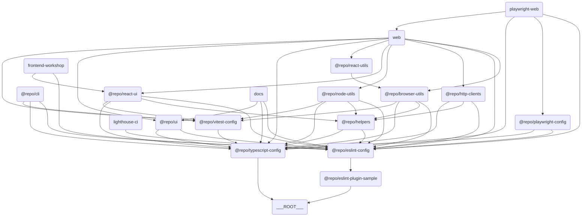

# 🗂️ Turborepo Template

[](https://github.com/iamhoonse-dev/turborepo-template/actions/workflows/test.yml)
[](https://github.com/iamhoonse-dev/turborepo-template/actions/workflows/release.yml)

## 📖 개요

`Turborepo Template`은 모노레포 관리랑 빌드를 단순화하려고 만든 템플릿이에요. 이 템플릿은 다양한 앱과 패키지를 포함하고 있어서, 팀 협업과 생산성을 높이는 데 도움을 줄 거예요.

## 🔗 구성 요소 간 관계도

이 템플릿은 여러 앱과 패키지로 구성돼 있어요. 각 앱과 패키지 간의 관계는 아래의 다이어그램을 참고해 주세요.



> 💡 **참고:**  
> 이 다이어그램은 [Mermaid](https://mermaid-js.github.io/mermaid/#/)를 사용해서 그렸어요. 이 도구는 텍스트 기반으로 다이어그램을 그릴 수 있게 해줘요. 아래의 코드를 복사해서 [Mermaid Live Editor](https://mermaid-js.github.io/mermaid-live-editor/)에 붙여넣으면 다이어그램을 시각적으로 확인할 수 있어요.

## 🚀 Quickstart

### Use this template

"Use this template" 버튼을 클릭해서 레포지토리를 생성한 후에, 아래의 명령어들을 실행해 주세요.

### 의존성 설치

이 프로젝트에서 제공하는 모노레포 명령어를 사용하려면 먼저 의존성을 설치해야 해요. 아래 명령어를 실행해 주세요:

```bash
pnpm install
```

### 소유자 ID 변경

코드베이스 내 모든 파일을 탐색하여 기존의 소유자 ID 가 기록되어 있는 부분을 변경해요.
코드에 대한 보다 자세한 내용은 [`tools/cli`의 README](./tools/cli/README.md#-제공-기능)를 참고해 주세요.

```bash
change-owner-name --name your-username
```

### 레포지토리 이름 변경

코드 베이스 내 모든 파일을 탐색하여 기존의 레포지토리 이름이 기록되어 있는 부분을 변경해요.
코드에 대한 보다 자세한 내용은 [`tools/cli`의 README](./tools/cli/README.md#-제공-기능)를 참고해 주세요.

```bash
rename-repository --name new-repository-name
```

### 스코프 이름 변경

코드 베이스 내 모든 파일을 탐색하여 기존의 스코프 이름이 기록되어 있는 부분을 변경해요.
만약 모노레포 내 일부 구성 요소들을 [npm](https://www.npmjs.com/) 의 특정 스코프(e.g. `new-scope-name`)로 배포해야 해서 해당 스코프 이름으로 변경해야 하는 경우에 유용할 거예요.
코드에 대한 보다 자세한 내용은 [`tools/cli`의 README](./tools/cli/README.md#-제공-기능)를 참고해 주세요.

```bash
rename-scope --name new-scope-name
```

### 🎉 Enjoy it !

Happy Hacking!

## 📦 구성 요소

### 🖥️ Apps

이 섹션은 다양한 애플리케이션을 포함하고 있어요. 각 앱은 특정 목적을 위해 설계되었으며, Next.js와 같은 최신 기술 스택을 활용하고 있어요.

- **[Docs](./apps/docs)**: Next.js 기반의 문서화 앱이에요.
- **[Web](./apps/web)**: Next.js 기반의 웹 애플리케이션이에요.
- **[Frontend Workshop](./apps/frontend-workshop)**: 컴포넌트 개발이랑 테스트를 위한 Storybook 환경이에요.

### 📦 Packages

이 섹션은 재사용 가능한 패키지 모음을 포함하고 있어요. 각 패키지는 특정 기능을 제공하며, 모노레포 구조에서 독립적으로 관리돼요.

- **[Browser Utils](./packages/browser-utils)**: 브라우저 관련 유틸리티 함수 모음이에요.
- **[ESLint Plugin Sample](./packages/eslint-plugin-sample)**: 샘플 ESLint 플러그인이에요.
- **[HTTP Clients](./packages/http-clients)**: HTTP 요청을 처리하려고 만든 클라이언트 라이브러리예요.
- **[Node Utils](./packages/node-utils)**: Node.js 환경에서 쓸 수 있는 유틸리티 함수 모음이에요.
- **[React UI](./packages/react-ui)**: React 기반 UI 컴포넌트 라이브러리예요.
- **[React Utils](./packages/react-utils)**: React 애플리케이션에서 쓸 수 있는 유틸리티 함수 모음이에요.
- **[UI](./packages/ui)**: 공통 UI 컴포넌트랑 스타일이에요.

### 🧩 Shared

이 섹션은 프로젝트 전반에서 재사용 가능한 내부 패키지를 포함하고 있어요. `shared` 디렉토리에 있는 패키지들은 npm에 배포되지 않고, 내부적으로만 사용돼요.

- **[Helpers](./shared/helpers)**: 프로젝트 전반에서 재사용 가능한 유틸리티 함수와 공통 로직을 제공하는 내부 패키지예요.

### 🛠️ Tools

이 섹션은 개발 및 테스트를 지원하는 도구들을 포함하고 있어요. 각 도구는 특정 작업을 자동화하거나 간소화하는 데 도움을 줘요.

- **[Playwright Web](./tools/playwright-web)**: Playwright 기반의 웹 테스트 도구예요.
- **[CLI](./tools/cli)**: 명령줄 작업을 자동화하고 프로젝트 관리 및 개발을 지원하기 위한 도구예요.
- **[Lighthouse CI](./tools/lighthouse-ci)**: 웹 애플리케이션의 성능, 접근성, SEO 등을 자동으로 측정하고 관리하기 위한 도구예요.

### ⚙️ Configs

이 섹션은 프로젝트 전반에서 사용되는 공통 설정 파일들을 포함하고 있어요. ESLint, TypeScript, Vitest와 같은 도구들의 설정이 포함돼요.

- **[ESLint Config](./configs/eslint-config)**: ESLint 설정을 위한 공통 구성이에요.
- **[Playwright Config](./configs/playwright-config)**: Playwright 테스트 설정이에요.
- **[TypeScript Config](./configs/typescript-config)**: TypeScript 설정을 위한 공통 구성이에요.
- **[Vitest Config](./configs/vitest-config)**: Vitest 테스트 설정을 위한 공통 구성이에요.

## 🔀 Workflows

이 프로젝트는 다음과 같은 GitHub Actions Workflow를 포함하고 있어요:

- **[Test](.github/workflows/test.yml)**: `test.yml` 파일에 정의되어 있으며, 프로젝트의 주요 테스트(유닛, E2E, Lighthouse, Storybook 등)를 통합적으로 실행해요.
  - 🐳 이 Workflow는 [`docker-compose.gha.yaml`](./docker-compose.gha.yaml) 파일을 사용해서 통합 테스트 환경을 설정해요.
  - 다양한 서비스(web, playwright, lighthouse, storybook 등)를 컨테이너로 띄워 실제 서비스 환경과 유사하게 테스트를 수행해요.
- **[Release](.github/workflows/release.yml)**: `release.yml` 파일에 정의되어 있으며, Changesets를 기반으로 패키지 배포를 자동화해요.

각 Workflow는 [`.github/workflows`](.github/workflows/) 디렉토리에 위치하고 있어요.

## 🐳 GitHub Container Registry 사용

일부 `docker-compose` 기반 워크플로우(예: Storybook, E2E, Lighthouse 테스트)에서는 Docker 이미지 빌드 시 [GitHub Container Registry(GHCR)](https://ghcr.io/)를 활용해서 이미지 레이어를 캐싱해요.  
이렇게 하면 워크플로우 실행 속도를 높이고, 불필요한 빌드 비용을 줄일 수 있어요.

> [!TIP]
> 관련 설정은 각 워크플로우의 `.yaml` 파일과 `docker-compose.*.yaml` 파일에서 확인할 수 있어요.
>
> - [`.github/workflows`](.github/workflows/)

## 🗼 Lighthouse CI GitHub App 사용

Lighthouse 테스트가 정상적으로 동작하려면 GitHub Secrets에 `LHCI_GITHUB_APP_TOKEN` 변수를 반드시 등록해야 해요.
이 토큰은 Lighthouse CI가 GitHub PR과 연동되어 결과를 보고하거나 상태 체크를 수행할 때 필요해요.

### `LHCI_GITHUB_APP_TOKEN` 등록 방법

1. GitHub 레포지토리 페이지로 이동해요.
2. `Settings` 탭을 클릭해요.
3. `Secrets and variables` 섹션으로 가요.
4. `Actions`를 선택해요.
5. `New repository secret` 버튼을 클릭해요.
6. [Lighthouse CI GitHub App](https://github.com/apps/lighthouse-ci)에서 발급받은 토큰을 `LHCI_GITHUB_APP_TOKEN`이라는 이름으로 추가해요.

> [!TIP]
> 토큰이 없으면 워크플로우의 `lighthouse-test` 작업에서 "github token not set" 경고가 발생할 수 있어요. 
> 실행 자체에는 문제가 없지만, Lighthouse test 결과를 웹에서 확인할 수 없게 되요.

## 🦋 패키지 버저닝 및 배포

이 프로젝트는 [Changesets](https://github.com/changesets/changesets)를 사용하여 패키지 버전 관리와 배포를 간소화하고 있어요. Changesets는 모노레포 환경에서 특히 유용하며, 각 패키지의 변경 사항을 추적하고 이를 기반으로 버전을 업데이트할 수 있도록 도와줘요.

### changesets 봇 사용을 위한 설정

changesets 봇을 사용하기 위해서는 GitHub 레포지토리의 설정을 변경해야 해요.
이 설정을 통해 Changesets 봇이 PR을 생성하고, 변경 사항을 자동으로 추적할 수 있어요.
아래의 단계를 따라 주세요:

1. GitHub 레포지토리 페이지로 이동해요.
2. `Settings` 탭을 클릭해요.
3. `Actions` 섹션으로 가요.
4. `General`을 선택해요.
5. Workflow Permissions에서 `Read repository contents permission`을 `Read and write permissions`로 변경해요.
6. 그리고 `Allow GitHub Actions to create and approve pull requests`를 체크해요.
7. `Save` 버튼을 클릭해요.

### npm 배포를 위한 토큰 설정

프로젝트의 secret 변수에 `NPM_TOKEN`을 설정해야 해요.
이 토큰은 npm에 패키지를 배포하는 데 사용돼요.
GitHub Secrets에 `NPM_TOKEN`을 추가하려면 아래의 단계를 따라 주세요:

1. GitHub 레포지토리 페이지로 이동해요.
2. `Settings` 탭을 클릭해요.
3. `Secrets and variables` 섹션으로 가요.
4. `Actions`를 선택해요.
5. `New repository secret` 버튼을 클릭해요.
6. [npm](https://www.npmjs.com/)에서 발급받은 토큰을 `NPM_TOKEN`이라는 이름으로 추가해요.
7. [`release.yml`](.github/workflows/release.yml) 파일에서 마지막의 "Create Release Pull Request" 단계의 `publish`에 주석 처리된 부분을 해제해요.

### 기본 사용 방법

1. 새 변경 사항 추가:

   ```bash
   pnpm changeset
   ```

   명령어를 실행하면 변경 사항에 대한 설명을 작성할 수 있는 프롬프트가 나타나요. 이를 통해 변경 사항을 기록할 수 있어요.

2. 버전 업데이트 및 변경 사항 적용:

   ```bash
   pnpm changeset version
   ```

   이 명령어는 모든 패키지의 버전을 업데이트하고, `CHANGELOG.md` 파일을 생성하거나 업데이트해요.

3. 배포:
   ```bash
   pnpm changeset publish
   ```
   이 명령어는 업데이트된 패키지를 npm에 배포해요. 배포를 위해서는 `NPM_TOKEN`이 GitHub Secrets에 설정되어 있어야 해요.

자세한 내용은 [공식 문서](https://github.com/changesets/changesets)를 참고하세요.

## ⬇️ 의존성 설치

### pnpm 설치

```bash
pnpm install
```

## 🧑‍💻 사용법

### CLI 사용

`pnpm install`을 실행하면 [`tools/cli`](./tools/cli)에 정의된 CLI 명령어들을 바로 사용할 수 있어요.

```bash
example --ls [directory-path]
example --mkdir <directory-name>
example --touch <file-name>
```

### 빌드

```bash
pnpm build
```

### 개발 서버 실행

```bash
pnpm dev
```

### 원격 캐싱 설정 (Optional)

필요에 따라 [Turborepo 공식 문서](https://turborepo.com/docs/core-concepts/remote-caching)를 참고하여 원격 캐싱을 사용하도록 설정할 수 있어요.

```bash
npx turbo login
npx turbo link
```

## 🤝 기여

이 템플릿에 기여하려면, [CONTRIBUTING.md](./CONTRIBUTING.md)를 참고해 주세요.

## 📜 라이선스

이 프로젝트는 MIT 라이선스 하에 배포돼요.
