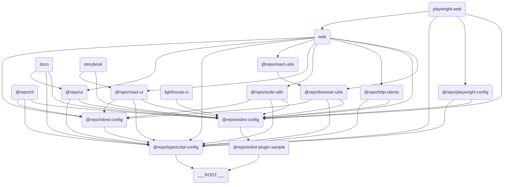

# 🗂️ Turborepo Template

## 📖 개요

`Turborepo Template`은 모노레포 관리랑 빌드를 단순화하려고 만든 템플릿이에요. 이 템플릿은 다양한 앱과 패키지를 포함하고 있어서, 팀 협업과 생산성을 높이는 데 도움을 줄 거예요.

## 📦 구성 요소

### 🖥️ Apps

- **[Docs](./apps/docs)**: Next.js 기반의 문서화 앱이에요.
- **[Web](./apps/web)**: Next.js 기반의 웹 애플리케이션이에요.
- **[Storybook](./apps/storybook)**: 컴포넌트 개발이랑 테스트를 위한 Storybook 환경이에요.

### 📦 Packages

- **[Browser Utils](./packages/browser-utils)**: 브라우저 관련 유틸리티 함수 모음이에요.
- **[ESLint Plugin Sample](./packages/eslint-plugin-sample)**: 샘플 ESLint 플러그인이에요.
- **[HTTP Clients](./packages/http-clients)**: HTTP 요청을 처리하려고 만든 클라이언트 라이브러리예요.
- **[Node Utils](./packages/node-utils)**: Node.js 환경에서 쓸 수 있는 유틸리티 함수 모음이에요.
- **[React UI](./packages/react-ui)**: React 기반 UI 컴포넌트 라이브러리예요.
- **[React Utils](./packages/react-utils)**: React 애플리케이션에서 쓸 수 있는 유틸리티 함수 모음이에요.
- **[UI](./packages/ui)**: 공통 UI 컴포넌트랑 스타일이에요.

### 🛠️ Tools

- **[Playwright Web](./tools/playwright-web)**: Playwright 기반의 웹 테스트 도구예요.
- **[CLI](./tools/cli)**: 명령줄 작업을 자동화하고 프로젝트 관리 및 개발을 지원하기 위한 도구예요.
- **[Lighthouse CI](./tools/lighthouse-ci)**: 웹 애플리케이션의 성능, 접근성, SEO 등을 자동으로 측정하고 관리하기 위한 도구예요.

### ⚙️ Configs

- **[ESLint Config](./configs/eslint-config)**: ESLint 설정을 위한 공통 구성이에요.
- **[Playwright Config](./configs/playwright-config)**: Playwright 테스트 설정이에요.
- **[TypeScript Config](./configs/typescript-config)**: TypeScript 설정을 위한 공통 구성이에요.
- **[Vitest Config](./configs/vitest-config)**: Vitest 테스트 설정을 위한 공통 구성이에요.

## 🔗 구성 요소 간 관계도

이 템플릿은 여러 앱과 패키지로 구성돼 있어요. 각 앱과 패키지 간의 관계는 아래의 다이어그램을 참고해 주세요.



> 💡 **참고:**  
> 이 다이어그램은 [Mermaid](https://mermaid-js.github.io/mermaid/#/)를 사용해서 그렸어요. 이 도구는 텍스트 기반으로 다이어그램을 그릴 수 있게 해줘요. 아래의 코드를 복사해서 [Mermaid Live Editor](https://mermaid-js.github.io/mermaid-live-editor/)에 붙여넣으면 다이어그램을 시각적으로 확인할 수 있어요.

## 🔀 Workflows

이 프로젝트는 다음과 같은 GitHub Actions Workflow를 포함하고 있어요:

- **[Install and Build](.github/workflows/install-and-build.yml)**: `install-and-build.yml` 파일에 정의되어 있으며, 프로젝트의 의존성 설치 및 빌드 작업을 자동화해요.
- **[Unit Test](.github/workflows/unit-test.yml)**: `unit-test.yml` 파일에 정의되어 있으며, 프로젝트의 유닛 테스트를 실행해요.
- **[Storybook Test](.github/workflows/storybook-test.yml)**: `storybook-test.yml` 파일에 정의되어 있으며, Storybook 환경에서 컴포넌트 테스트를 실행해요.
  - 🐳 이 Workflow는 [`docker-compose.storybook.yaml`](./docker-compose.storybook.yaml) 파일을 사용해서 Storybook 테스트 환경을 설정해요.
- **[End-to-End Test](.github/workflows/e2e-test.yml)**: `e2e-test.yml` 파일에 정의되어 있으며, End-to-End 테스트를 실행해요.
  - 🐳 이 Workflow는 [`docker-compose.e2e.yaml`](./docker-compose.e2e.yaml) 파일을 사용해서 E2E 테스트 환경을 설정해요.
- **[Lighthouse Test](.github/workflows/lighthouse-test.yml)**: `lighthouse-test.yml` 파일에 정의되어 있으며, Lighthouse를 사용해서 웹사이트의 성능, 접근성, SEO 등을 테스트해요.
  - 🐳 이 Workflow는 [`docker-compose.lighthouse.yaml`](./docker-compose.lighthouse.yaml) 파일을 사용해서 Lighthouse 테스트 환경을 설정해요.

각 Workflow는 `.github/workflows/` 디렉토리에 위치하고 있어요.

## ⬇️ 의존성 설치

### pnpm 설치

```bash
pnpm install
```

## 🧑‍💻 사용법

### CLI 사용

`pnpm install`을 실행하면 `tools/cli`에 정의된 CLI 명령어들을 바로 사용할 수 있어요.

```bash
example --ls [directory-path]
example --mkdir <directory-name>
example --touch <file-name>
```

### 프로젝트 초기 설정

"Use this template" 버튼을 클릭해서 레포지토리를 생성한 후에, 필요에 따라 아래의 명령어들을 실행해 주세요.

#### 소유자 ID 변경

코드베이스 내 모든 파일을 탐색하여 기존의 소유자 ID 가 기록되어 있는 부분을 변경해요.

```bash
change-owner-name -n your-username

# or equivalently

change-owner-name --name your-username
```

#### 레포지토리 이름 변경

코드 베이스 내 모든 파일을 탐색하여 기존의 레포지토리 이름이 기록되어 있는 부분을 변경해요.

```bash
rename-repository -n new-repository-name

# or equivalently

rename-repository --name new-repository-name
```

#### 스코프 이름 변경

코드 베이스 내 모든 파일을 탐색하여 기존의 스코프 이름이 기록되어 있는 부분을 변경해요. \
만약 모노레포 내 일부 구성 요소들을 [npm](https://www.npmjs.com/) 의 특정 스코프(e.g. `new-scope-name`)로 배포해야 해서 해당 스코프 이름으로 변경해야 하는 경우에 유용할 거예요.

```bash
rename-scope -n new-scope-name

# or equivalently

rename-scope --name new-scope-name
```

### 빌드

```bash
pnpm build
```

### 개발 서버 실행

```bash
pnpm dev
```

### 원격 캐싱 설정 (Optional)

필요에 따라 [Turborepo 공식 문서](https://turborepo.com/docs/core-concepts/remote-caching)를 참고하여 원격 캐싱을 사용하도록 설정할 수 있어요.

```bash
npx turbo login
npx turbo link
```

## 🤝 기여

이 템플릿에 기여하려면, [CONTRIBUTING.md](./CONTRIBUTING.md)를 참고해 주세요.

## 📜 라이선스

이 프로젝트는 MIT 라이선스 하에 배포돼요.
