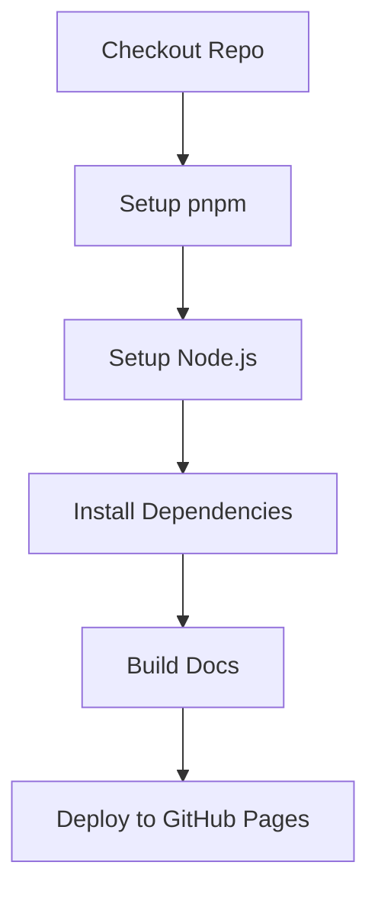

import { Callout } from "nextra/components";
import LocalizedLink from "../../../components/LocalizedLink";

# 📖 Publish Github Pages

This document explains the main operations of the `.github/workflows/publish-github-pages.yml` GitHub Actions workflow.

<Callout type="info">
  This workflow deploys the documentation site written in `apps/docs` to GitHub Pages.
  For more details on how this project deploys to GitHub Pages,
  please refer to the <LocalizedLink href="/documentation/publishing-pages">`Documentation > Publishing Pages`</LocalizedLink> document.
</Callout>

## Workflow Overview

This workflow automatically deploys the documentation site to GitHub Pages.
It mainly runs when changes are detected in the `main` branch, builds the static site, and deploys it to the `gh-pages` branch.

- Install and cache dependencies
- Build the static site
- Deploy to GitHub Pages

## Execution Flow

### Sequential Execution

This workflow consists of a single job and executes the following steps in order.

## Main Stage Descriptions

### Checkout Repo

- Checks out the repository code.

### Setup pnpm

- Sets up the pnpm package manager.

### Setup Node.js

- Installs the Node.js version specified in the `.nvmrc` file and enables pnpm cache.

### Install Dependencies

- Installs dependencies with `pnpm install --frozen-lockfile`.

### Build Docs

- Builds the documentation site statically.
  (e.g., use `pnpm run build` or `pnpm docs:build` depending on your project)

### Deploy to GitHub Pages

- Deploys the built static files to the `gh-pages` branch for hosting on GitHub Pages.
- Uses `GITHUB_TOKEN` to grant deployment permissions.

Through this workflow, the documentation site is automatically deployed and kept up to date.
