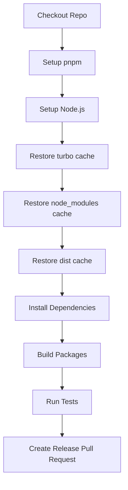

import { Callout } from "nextra/components";
import LocalizedLink from "../../../components/LocalizedLink";

# 🦋 Release

This document explains the main operations of the `.github/workflows/release.yml` GitHub Actions workflow.

<Callout type="info">
  This workflow automatically runs when code is pushed and automates the testing process.
  For more details on how testing is conducted in this project,
  please refer to the <LocalizedLink href="/testing/testing-environment">`Testing > Automated Test Execution Environment`</LocalizedLink> document.
</Callout>

## Workflow Overview
## Workflow Overview
This workflow automatically runs when a push occurs to the `main` branch and automates the following release processes:
This workflow automatically runs when code is pushed and automates the following testing and build processes:
- Caching dependencies and build/deployment artifacts
- Installing and caching dependencies
- Project build and testing
- Generating and uploading coverage reports
- Running Lighthouse, E2E, and Storybook tests in a Docker environment
## Execution Flow
## Execution Flow
### Sequential Execution
### Parallel Execution
This workflow consists of a single job and executes the following steps in order.
Each job in this workflow runs in parallel and proceeds in the order shown in the diagram below.

## Main Job Descriptions
## Main Stage Descriptions

### Checkout Repo
- Installs dependencies, restores cache, builds, and runs unit tests.
- Generates a test coverage report and uploads it as an artifact along with the result logs.

### Setup pnpm

- Converts and caches Docker Compose files.
- Prepares the environment for use in subsequent jobs.
### Setup Node.js

- Installs the Node.js version specified in the `.nvmrc` file and enables pnpm cache.
- Runs after the `set-docker-compose` job.
- Runs Lighthouse tests in a Docker environment to check web performance.

- Restores TurboRepo build cache to speed up builds.

- Runs after the `set-docker-compose` job.
- Performs E2E (End-to-End) tests using Playwright in a Docker environment.
- Uploads the test result report as an artifact.

### Restore dist cache

- Runs after the `set-docker-compose` job.
- Runs Storybook and Storybook Test Runner in a Docker environment to perform accessibility (a11y) tests on UI components.
- Uploads the accessibility report as an artifact.

Each job runs in parallel or sequentially, and efficient CI/CD pipelines are built through caching and artifact uploads.
### Build Packages

- Builds all packages with `pnpm run build`.

### Run Tests

- Runs tests with `pnpm run test`.

### Create Release Pull Request

- Uses Changesets to bump the versions of changed packages and automatically creates a release PR.
- If you want to publish to NPM, you can add the relevant settings and secrets for automatic deployment.

This workflow provides an efficient and consistent release process through caching and automated release PR creation.
