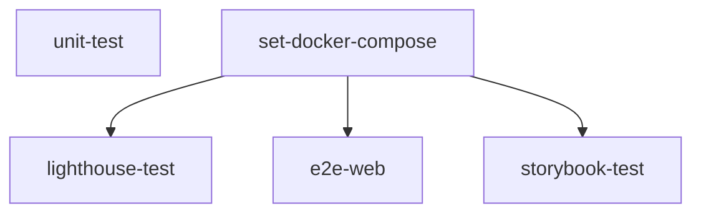

import { Callout } from "nextra/components";
import LocalizedLink from "../../../components/LocalizedLink";

# 🧪 Test

This document explains the main operations of the `.github/workflows/test.yml` GitHub Actions workflow.

<Callout type="info">
  This workflow automatically runs when code is pushed and automates the testing process.
  For more details on how testing is conducted in this project,
  please refer to the <LocalizedLink href="/testing/testing-environment">`Testing > Automated Test Execution Environment`</LocalizedLink> document.
</Callout>

## Workflow Overview

This workflow automatically runs when code is pushed and automates the following testing and build processes:

- Installing and caching dependencies
- Project build and testing
- Generating and uploading coverage reports
- Running Lighthouse, E2E, and Storybook tests in a Docker environment

## Execution Flow

### Parallel Execution

Each job in this workflow runs in parallel and proceeds in the order shown in the diagram below.

## Main Job Descriptions

### unit-test

- Installs dependencies, restores cache, builds, and runs unit tests.
- Generates a test coverage report and uploads it as an artifact along with the result logs.

### set-docker-compose

- Converts and caches Docker Compose files.
- Prepares the environment for use in subsequent jobs.

### lighthouse-test

- Runs after the `set-docker-compose` job.
- Runs Lighthouse tests in a Docker environment to check web performance.

### e2e-web

- Runs after the `set-docker-compose` job.
- Performs E2E (End-to-End) tests using Playwright in a Docker environment.
- Uploads the test result report as an artifact.

### storybook-test

- Runs after the `set-docker-compose` job.
- Runs Storybook and Storybook Test Runner in a Docker environment to perform accessibility (a11y) tests on UI components.
- Uploads the accessibility report as an artifact.

Each job runs in parallel or sequentially, and efficient CI/CD pipelines are built through caching and artifact uploads.
