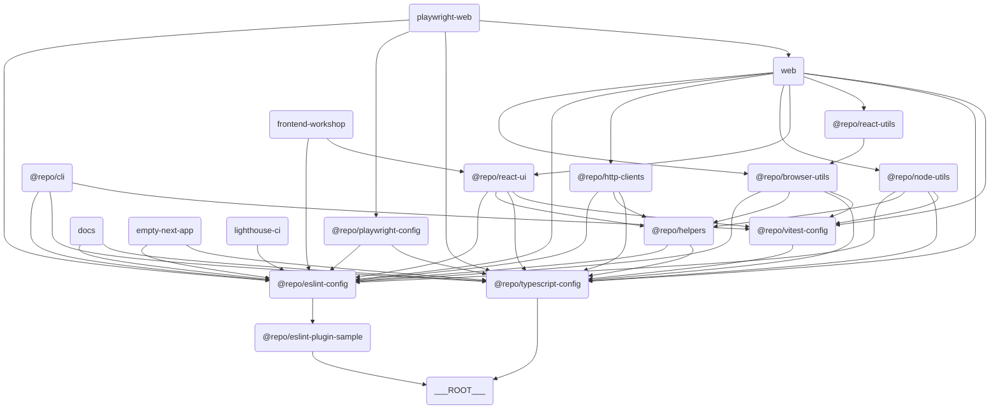

import LocalizedLink from "../../components/LocalizedLink";

# 🧭 Overview

## 📖 Overview

`turborepo-template` is a template created to simplify monorepo management and builds. This template includes various apps and packages, helping to enhance team collaboration and productivity.

## 🗃️ Main External Packages/Tools Dependencies

This template relies on several external packages and tools to simplify the development environment setup and build process. Below is a list of the main dependencies:

| Category         | Package/Tool Name & Description |
|------------------|-------------------------------|
| **Package Manager** | pnpm                        |
| **Monorepo Management** | turborepo (turbo)       |
| **Language/Transpiler** | typescript              |
| **Formatter**       | prettier                    |
| **Commit/Hooks**    | husky, @commitlint/cli, @commitlint/config-conventional |
| **Linter**          | eslint                      |
| **Testing**         | vitest, @testing-library/react, @testing-library/dom, @testing-library/jest-dom, @testing-library/user-event, jsdom |
| **Build/Bundler**   | next, @vitejs/plugin-react, vite-tsconfig-paths |
| **UI Framework**    | react, react-dom            |
| **E2E/Performance Testing** | playwright, lighthouse, lighthouse-ci |
| **Versioning**      | changesets                  |
| **Documentation**   | nextra, mdx                 |

---

## 🔗 Component Relationship Diagram

This template consists of multiple apps and packages. Refer to the diagram below for the relationships between each app and package.



> 💡 **Note:**
> This diagram was created using [Mermaid](https://mermaid-js.github.io/mermaid/#/). This tool allows you to draw diagrams based on text. You can copy the code below and paste it into the [Mermaid Live Editor](https://mermaid-js.github.io/mermaid-live-editor/) to visually check the diagram.

## 📦 Components

### 🖥️ Apps

This section includes various applications. Each app is designed for a specific purpose and utilizes modern tech stacks like Next.js.

- <LocalizedLink href="/apps/sample-apps/empty-next-app">`Empty Next App`</LocalizedLink>: A blank application template using Next.js.
- <LocalizedLink href="/apps/sample-apps/web">`Web`</LocalizedLink>: A web application based on Next.js.
- <LocalizedLink href="/apps/sample-apps/frontend-workshop">`Frontend Workshop`</LocalizedLink>: A Storybook environment for component development and testing.
- <LocalizedLink href="/apps/sample-apps/docs">`Docs`</LocalizedLink>: A Next.js-based documentation project for this repository, written using Nextra.

### 📦 Packages

This section contains a collection of reusable packages. Each package provides specific functionality and is managed independently within the monorepo structure.
Some of the packages here are configured to be published to [npm](https://npmjs.org). \
(🟢: Packages set to be published to npm, 🛑: Packages not set to be published to npm)

- <LocalizedLink href="/packages/default-packages/browser-utils">🟢 `Browser Utils`</LocalizedLink>: A collection of browser-related utility functions.
- <LocalizedLink href="/packages/default-packages/eslint-plugin-sample">🟢 `ESLint Plugin Sample`</LocalizedLink>: A sample ESLint plugin.
- <LocalizedLink href="/packages/default-packages/http-clients">🛑 `HTTP Clients`</LocalizedLink>: A client library for handling HTTP requests.
- <LocalizedLink href="/packages/default-packages/node-utils">🟢 `Node Utils`</LocalizedLink>: A collection of utility functions for Node.js environments.
- <LocalizedLink href="/packages/default-packages/react-ui">🟢 `React UI`</LocalizedLink>: A React-based UI component library.
- <LocalizedLink href="/packages/default-packages/react-utils">🟢 `React Utils`</LocalizedLink>: A collection of utility functions for React applications.

### 🧩 Shared

This section contains internal packages that are reusable throughout the project. Packages in the `shared` directory are not published to npm and are used internally only.

- <LocalizedLink href="/shared/shared-codes">`Helpers`</LocalizedLink>: An internal package providing reusable utility functions and common logic across the project.

### 🛠️ Tools

This section includes tools that support development and testing. Each tool helps automate or simplify specific tasks.

- <LocalizedLink href="/tools/playwright-web">`Playwright Web`</LocalizedLink>: A web testing tool based on Playwright.
- <LocalizedLink href="/tools/clis">`CLI`</LocalizedLink>: Tools for automating command-line tasks and supporting project management and development.
- <LocalizedLink href="/tools/lighthouse-ci">`Lighthouse CI`</LocalizedLink>: A tool for automatically measuring and managing web application performance, accessibility, SEO, etc.

### ⚙️ Configs

This section contains common configuration files used throughout the project, including settings for tools like ESLint, TypeScript, and Vitest.

- <LocalizedLink href="/configs/eslint-config">`ESLint Config`</LocalizedLink>: Common configuration for ESLint.
- <LocalizedLink href="/configs/playwright-config">`Playwright Config`</LocalizedLink>: Configuration for Playwright tests.
- <LocalizedLink href="/configs/typescript-config">`TypeScript Config`</LocalizedLink>: Common configuration for TypeScript.
- <LocalizedLink href="/configs/vitest-config">`Vitest Config`</LocalizedLink>: Common configuration for Vitest tests.

## 🔀 Workflows

This project includes the following GitHub Actions Workflows:

### 🧪 Test

Defined in the <LocalizedLink href="/cicd/test">`test.yml`</LocalizedLink> file, this workflow runs the main tests of the project (unit, E2E, Lighthouse, Storybook, etc.) in an integrated manner.
This workflow includes the following tests: \
(🐳 means tests run in Docker containers on GitHub Actions)

- <LocalizedLink href="/testing/unit-test">`unit test`</LocalizedLink>
- <LocalizedLink href="/testing/e2e-test">🐳 `e2e test`</LocalizedLink>
- <LocalizedLink href="/testing/lighthouse-test">🐳 `lighthouse test`</LocalizedLink>
- <LocalizedLink href="/testing/storybook-test">🐳 `storybook test`</LocalizedLink>

### 🚀 Release

Defined in the <LocalizedLink href="/cicd/release">`release.yml`</LocalizedLink> file, this workflow automates package publishing based on Changesets.

- This workflow uses the Changesets bot to create PRs and automatically track changes.
- When the PR is approved, the version of the changed package is updated and a CHANGELOG.md file is generated.
- When the approved PR is merged, the workflow uses NPM_TOKEN to publish the package to npm.

### 📖 Publish GitHub Pages

Defined in the <LocalizedLink href="/cicd/publish-github-pages">`publish-github-pages.yml`</LocalizedLink> file, this workflow deploys the <LocalizedLink href="/docs/apps/docs">docs</LocalizedLink> app to GitHub Pages.

## 🐙 CI/CD with GitHub

This project utilizes various GitHub features to automate deployment and testing. Below are the main features and setup methods:

### 🐳 GitHub Container Registry

Some `docker-compose`-based workflows (e.g., Storybook, E2E, Lighthouse tests) use [GitHub Container Registry (GHCR)](https://ghcr.io/) to cache image layers when building Docker images.
This speeds up workflow execution and reduces unnecessary build costs.

### 📖 GitHub Pages

This project deploys the <LocalizedLink href="/apps/sample-apps/docs">`docs`</LocalizedLink> app using GitHub Pages.
To ensure GitHub Pages deployment works properly, you must enable Pages in the repository Settings.

### 💬 Giscus GitHub App

This project integrates GitHub Discussions into the documentation app using Giscus. Giscus is a comment system based on GitHub Discussions, allowing you to leave comments on documentation.

### 🗼 Lighthouse CI GitHub App

To ensure Lighthouse tests work properly, you must register the `LHCI_GITHUB_APP_TOKEN` variable in GitHub Secrets.
This token is required for Lighthouse CI to report results or perform status checks in conjunction with GitHub PRs.

### 🦋 Package Versioning and Publishing

This project uses [Changesets](https://github.com/changesets/changesets) to simplify package version management and publishing. Changesets are especially useful in monorepo environments, helping you track changes for each package and update versions accordingly.

## ⬇️ Installing Dependencies

### Install pnpm

```bash
pnpm install
```

## 🧑‍💻 Usage

### Using the CLI

After running `pnpm install`, you can use the CLI commands defined in <LocalizedLink href="/tools/clis">`tools/cli`</LocalizedLink> right away.

```bash
example --ls [directory-path]
example --mkdir <directory-name>
example --touch <file-name>
```

### Build

```bash
pnpm build
```

### Run Development Server

```bash
pnpm dev
```

### Remote Caching Setup (Optional)

If needed, refer to the [Turborepo official documentation](https://turborepo.com/docs/core-concepts/remote-caching) to enable remote caching.

```bash
npx turbo login
npx turbo link
```

## 🤝 Contributing

To contribute to this template, please refer to [CONTRIBUTING.md](./CONTRIBUTING.md).

## 📜 License

This project is distributed under the MIT License.
