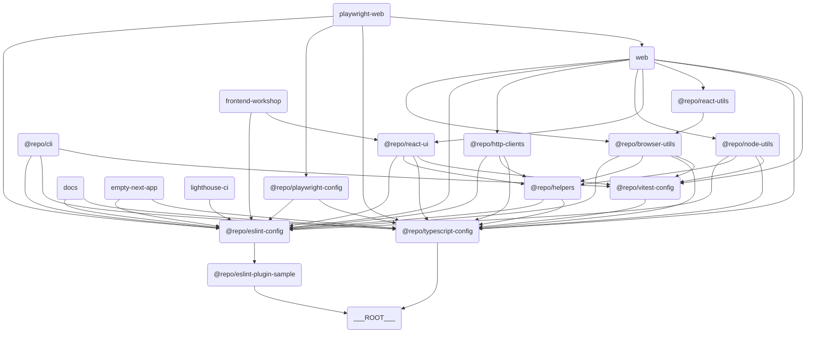

# 🧭 Overview

[](https://github.com/iamhoonse-dev/turborepo-template/actions/workflows/test.yml)
[](https://github.com/iamhoonse-dev/turborepo-template/actions/workflows/release.yml)
[](https://github.com/iamhoonse-dev/turborepo-template/actions/workflows/publish-github-pages.yml)

## 📖 Overview

`turborepo-template` is a template designed to simplify monorepo management and builds. This template includes various apps and packages to help improve team collaboration and productivity.

## 🔗 Component Relationship Diagram

This template consists of multiple apps and packages. Refer to the diagram below for the relationships between each app and package.



> 💡 **Note:**
> This diagram is drawn using [Mermaid](https://mermaid-js.github.io/mermaid/#/). This tool allows you to create diagrams based on text. You can copy the code below and paste it into the [Mermaid Live Editor](https://mermaid-js.github.io/mermaid-live-editor/) to view the diagram visually.

## 📦 Components

### 🖥️ Apps

This section includes various applications. Each app is designed for a specific purpose and utilizes modern tech stacks such as Next.js.

- **[Empty Next App](./apps/empty-next-app)**: A blank application template using Next.js.
- **[Web](./apps/web)**: A web application based on Next.js.
- **[Frontend Workshop](./apps/frontend-workshop)**: A Storybook environment for component development and testing.
- **[Docs](./apps/docs)**: A Next.js-based documentation project for this repository, written using [Nextra](https://nextra.site/).

### 📦 Packages

This section includes a collection of reusable packages. Each package provides specific functionality and is managed independently in the monorepo structure.
Some of the packages here are configured to be published to [npm](https://npmjs.org).

- **[Browser Utils](./packages/browser-utils)**: A collection of browser-related utility functions.
- 🟢 Configured to be published to [npm](https://npmjs.org).
- **[ESLint Plugin Sample](./packages/eslint-plugin-sample)**: A sample ESLint plugin.
- 🟢 Configured to be published to [npm](https://npmjs.org).
- **[HTTP Clients](./packages/http-clients)**: A client library for handling HTTP requests.
- 🛑 Not configured to be published to [npm](https://npmjs.org).
- **[Node Utils](./packages/node-utils)**: Utility functions for Node.js environments.
- 🟢 Configured to be published to [npm](https://npmjs.org).
- **[React UI](./packages/react-ui)**: A React-based UI component library.
- 🟢 Configured to be published to [npm](https://npmjs.org).
- **[React Utils](./packages/react-utils)**: Utility functions for React applications.
- 🟢 Configured to be published to [npm](https://npmjs.org).

### 🧩 Shared

This section includes internal packages that are reusable throughout the project. Packages in the `shared` directory are not published to npm and are used internally only.

- **[Helpers](./shared/helpers)**: An internal package providing reusable utility functions and common logic across the project.

### 🛠️ Tools

This section includes tools that support development and testing. Each tool helps automate or simplify specific tasks.

- **[Playwright Web](./tools/playwright-web)**: A web testing tool based on Playwright.
- **[CLI](./tools/cli)**: Tools for automating command-line tasks and supporting project management and development.
- **[Lighthouse CI](./tools/lighthouse-ci)**: Tools for automatically measuring and managing web application performance, accessibility, SEO, etc.

### ⚙️ Configs

This section includes common configuration files used throughout the project. It includes settings for tools such as ESLint, TypeScript, and Vitest.

- **[ESLint Config](./configs/eslint-config)**: Common configuration for ESLint.
- **[Playwright Config](./configs/playwright-config)**: Playwright test configuration.
- **[TypeScript Config](./configs/typescript-config)**: Common configuration for TypeScript.
- **[Vitest Config](./configs/vitest-config)**: Common configuration for Vitest tests.

## 🔀 Workflows

This project includes the following GitHub Actions workflows:

### 🧪 **[Test](.github/workflows/test.yml)**

Defined in [`test.yml`](.github/workflows/test.yml), this workflow runs the main tests (unit, E2E, Lighthouse, Storybook, etc.) for the project.

- This workflow includes the following tests:
- [unit test](.github/workflows/test.yml#L13)
- [e2e test](.github/workflows/test.yml#L167)
- [lighthouse test](.github/workflows/test.yml#L139)
- [storybook test](.github/workflows/test.yml#L209)
- Among these, e2e, lighthouse, and storybook tests use the [`docker-compose.gha.yaml`](./docker-compose.gha.yaml) file to set up an integrated test environment.
- Various services (web, playwright, lighthouse, storybook, etc.) are run as containers to test in an environment similar to production.

### 🚀 **[Release](.github/workflows/release.yml)**

Defined in [`release.yml`](.github/workflows/release.yml), this workflow automates package publishing based on Changesets.

- This workflow uses the Changesets bot to create PRs and automatically track changes.
- When a PR is approved, the version of the changed package is updated and a `CHANGELOG.md` file is generated.
- When the approved PR is merged, the workflow uses `NPM_TOKEN` to publish the package to npm.

### 📖 [Publish GitHub Pages](.github/workflows/publish-github-pages.yml)

Defined in [`publish-github-pages.yml`](.github/workflows/publish-github-pages.yml), this workflow deploys the [`docs`](./apps/docs) app to GitHub Pages.

- This workflow builds the `docs` app and deploys the build output to GitHub Pages.
- To deploy to GitHub Pages, you must enable Pages in the repository Settings.
- The deployed documentation can be accessed at a URL like [https://(USER_ID).github.io/(PROJECT_NAME)](https://iamhoonse-dev.github.io/turborepo-template/).

> [!WARNING]
> If you do not enable GitHub Pages, the [`publish-github-pages.yml`](.github/workflows/publish-github-pages.yml) workflow may fail. \
> As a result, the [`docs`](./apps/docs) app will not be deployed properly. \
> Please follow the guide in the [Using GitHub Pages](#-github-pages-사용) section below to enable GitHub Pages.

## 🐳 Using GitHub Container Registry

Some `docker-compose`-based workflows (e.g., Storybook, E2E, Lighthouse tests) use [GitHub Container Registry (GHCR)](https://ghcr.io/) to cache image layers when building Docker images.
This speeds up workflow execution and reduces unnecessary build costs.

## 📖 Using GitHub Pages

This project uses GitHub Pages to deploy the [`docs`](./apps/docs) app.
To ensure GitHub Pages deployment works properly, you need to enable Pages in the Settings.

## 💬 Using Giscus GitHub App

This project integrates GitHub Discussions into the documentation app using Giscus. Giscus is a comment system based on GitHub Discussions, allowing users to leave comments on documentation pages.

## 🗼 Using Lighthouse CI GitHub App

To ensure Lighthouse tests work properly, you must register the `LHCI_GITHUB_APP_TOKEN` variable in your GitHub Secrets.
This token is required for Lighthouse CI to report results or perform status checks in conjunction with GitHub PRs.

## 🦋 Package Versioning and Publishing

This project uses [Changesets](https://github.com/changesets/changesets) to simplify package version management and publishing. Changesets are especially useful in a monorepo environment, helping you track changes for each package and update versions accordingly.

## ⬇️ Installing Dependencies

### Install with pnpm

```bash
pnpm install
```

## 🧑‍💻 Usage

### Using the CLI

After running `pnpm install`, you can use the CLI commands defined in [`tools/cli`](./tools/cli) right away.

```bash
example --ls [directory-path]
example --mkdir <directory-name>
example --touch <file-name>
```

### Build

```bash
pnpm build
```

### Run Development Server

```bash
pnpm dev
```

### Remote Caching Setup (Optional)

If needed, refer to the [Turborepo documentation](https://turborepo.com/docs/core-concepts/remote-caching) to set up remote caching.

```bash
npx turbo login
npx turbo link
```

## 🤝 Contributing

To contribute to this template, please refer to [CONTRIBUTING.md](./CONTRIBUTING.md).

## 📜 License

This project is distributed under the MIT License.