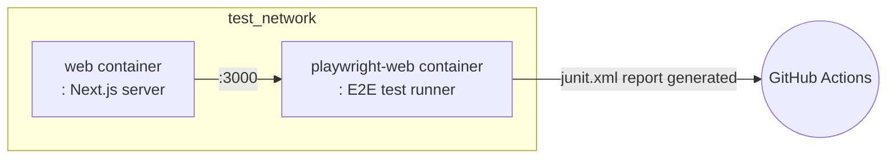

# 🚦 End-to-end Test

This project automatically runs E2E (End-to-end) tests in the CI environment.  
Below are the main steps performed in the `e2e-web` job of the `.github/workflows/test.yml` workflow.

## 💻 Test Environment

### 🐳 Docker-based E2E Test

This workflow uses Docker to run E2E tests.
Using **Docker Compose**, it runs the web server and Playwright test runner containers as shown below,
and uploads the test results as GitHub Actions artifacts.

## 🔄 Test Workflow

### Step-by-step Description

1. **Checkout code and restore cache**
   - Checks out the source code and restores the converted docker-compose file from cache.

2. **Login to GitHub Container Registry**
   - Logs in to ghcr.io to build and run E2E test-related images.

3. **Prepare Docker network**
   - Creates an external Docker network named `test_network` if it does not exist.

4. **Build E2E images**
   - Uses the `docker-compose.gha.converted.yaml` file to build two images: `web` and `playwright-web`.

5. **Run E2E tests**
   - Runs the `web` and `playwright-web` containers to perform E2E tests.
   - Executes tests in the `playwright-web` container and saves the results in the `test-results/junit.xml` file inside the container.
   - Stops both containers after all processes in the `playwright-web` container are complete.

6. **Copy E2E report**
   - After the tests are complete, copies the `test-results/junit.xml` file from inside the `playwright-web` container to the host.

7. **Upload report**
   - Uploads the copied E2E report as a GitHub Actions artifact.

## 🧪 What tests are run?

### Playwright

E2E tests are based on Playwright,  
and the test scripts defined in the `tools/playwright-web` directory are executed.

- Playwright simulates user actions in a real browser environment to verify the entire flow.
- Test results are generated in JUnit XML format and saved in the `test-results/junit.xml` file inside the container.
- Exceptions are handled so that the workflow does not stop even if tests fail.

In summary, automated E2E tests for major user scenarios are run, and the results are saved as reports.

## 📦 Test Artifacts

### E2E Automated Test Results

After the tests are complete, the E2E test results are saved in the `test-results/junit.xml` file inside the `playwright-web` container.
These results are uploaded as GitHub Actions artifacts and can be downloaded and checked later.

#### Purpose

This report automatically verifies whether the main features work correctly from the actual user's perspective and helps quickly identify issues when they occur.

## 📌 Reference

For detailed workflow, refer to the `e2e-web` job in the `.github/workflows/test.yml` file.

