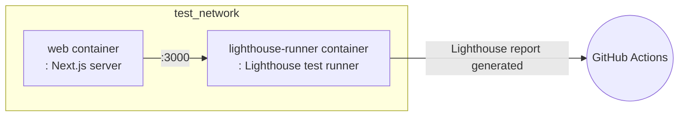

# 🗼 Lighthouse Test

This project automatically runs Lighthouse tests in the CI environment.
Below are the main steps performed in the `lighthouse-test` job of the `.github/workflows/test.yml` workflow.

## 💻 Test Environment

### 🐳 Docker-based Lighthouse Test

This workflow uses Docker to run Lighthouse tests.
Using **Docker Compose**, it runs the web server and Lighthouse CI runner containers as shown below,
and uploads the test results as GitHub Actions artifacts.

## 🔄 Test Workflow

### Step-by-step Description

1. **Checkout code and restore cache**
- Checks out the source code and restores the converted docker-compose file from cache.

2. **Login to GitHub Container Registry**
- Logs in to ghcr.io to build and run Lighthouse test-related images.

3. **Prepare Docker network**
- Creates an external Docker network named `test_network` if it does not exist.

4. **Build Lighthouse images**
- Uses the `docker-compose.gha.converted.yaml` file to build two images: `web` and `lighthouse-runner`.

5. **Run Lighthouse tests**
- Runs the `web` and `lighthouse-runner` containers to perform Lighthouse tests.
- Executes tests in the `lighthouse-runner` container.
- Stops both containers after all processes in the `lighthouse-runner` container are complete.

6. **Lighthouse report upload**
- According to the `.lighthouserc.cjs` configuration, the test results are uploaded to Temporary Public Storage.

## 🧪 What tests are run?

### Lighthouse CI

Lighthouse tests are based on Lighthouse CI,
and are executed according to the configuration defined in the `tools/lighthouse-ci` directory.

- Lighthouse automatically analyzes web pages for performance, accessibility, SEO, best practices, and more.
- Test results are generated in various formats such as HTML and JSON, saved inside the container, and uploaded to Temporary Public Storage.
- Exceptions are handled so that the workflow does not stop even if tests fail.

In summary, automated Lighthouse analysis is run for major web pages, and the results are saved as reports.

## 📦 Test Artifacts

### Lighthouse Automated Analysis Results

After the tests are complete, Lighthouse reports are generated and uploaded to Temporary Public Storage.

#### Purpose

This report automatically analyzes various quality metrics such as performance, accessibility, and SEO of web pages, and provides information for improvement.

## 📌 Reference

For detailed workflow, refer to the `lighthouse-test` job in the `.github/workflows/test.yml` file.

