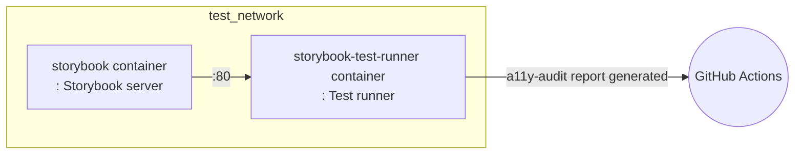

# 📚 Storybook Test

This project automatically runs Storybook tests in the CI environment.  
Below are the main steps performed in the `storybook-test` job of the `.github/workflows/test.yml` workflow.

## 💻 Test Environment

### 🐳 Docker-based Storybook Test

This workflow uses Docker to run Storybook tests.
Using **Docker Compose**, it runs the Storybook server and test runner containers as shown below,
and uploads the test results as GitHub Actions artifacts.

## 🔄 Test Workflow

### Step-by-step Description

1. **Checkout code and restore cache**
- Checks out the source code and restores the converted docker-compose file from cache.

2. **Login to GitHub Container Registry**
- Logs in to ghcr.io to build and run Storybook-related images.

3. **Prepare Docker network**
- Creates an external Docker network named `test_network` if it does not exist.

4. **Build Storybook images**
- Uses the `docker-compose.gha.converted.yaml` file to build two images: `storybook` and `storybook-test-runner`.

5. **Run Storybook tests**
- Runs the `storybook` and `storybook-test-runner` containers to perform Storybook tests.
- Executes tests in the `storybook-test-runner` container and saves the results in the `a11y-audit` directory inside the container.
- Stops both containers after all processes in the `storybook-test-runner` container are complete.

6. **Copy accessibility (A11y) report**
- After the tests are complete, copies the accessibility audit results (`a11y-audit` folder) from inside the `storybook-test-runner` container to the host.

7. **Upload report**
- Uploads the copied accessibility report as a GitHub Actions artifact.

## 🧪 What tests are run?

### axe-playwright

Storybook tests are executed according to the configuration defined in the `apps/frontend-workshop/.storybook/test-runner.ts` file.  
This configuration uses **axe-playwright** to automatically audit accessibility (A11y) for each Storybook story.

- Before visiting each story, the test runner injects `axe-core` into the page and sets rules according to the story's a11y parameters.
- Accessibility audits are performed on specific elements of each story (default: `body`).
- Audit results are generated in JUnit XML format and saved in the `test-results/a11y-audit` folder inside the container.
- Exceptions are handled so that the workflow does not stop even if tests fail.

In summary, axe-based accessibility automated tests are run for all Storybook components, and the results are saved as reports.

## 📦 Test Artifacts

### Accessibility (A11y) Automated Audit Results

After the tests are complete, the accessibility audit results are saved in the `a11y-audit` folder inside the `storybook-test-runner` container.
These results are uploaded as GitHub Actions artifacts and can be downloaded and checked later.

#### Purpose

This report automatically detects accessibility issues in Storybook components and provides information for improvement.

## 📌 Reference

For detailed workflow, refer to the `storybook-test` job in the `.github/workflows/test.yml` file.

