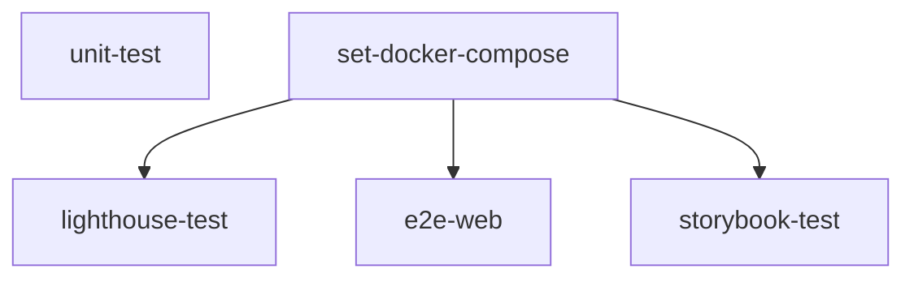

# 🤖 Automated Test Execution Environment

This project provides an automated test environment using GitHub Actions.
Various tests are run throughout the process of merging and deploying code to maintain code quality and to detect and resolve issues before deployment.

## 🔄 Workflow Structure (`.github/workflows/test.yml`)

This workflow consists of several test jobs, each with the following roles:

### Summary

### 1. `unit-test`
- Responsible for **installing dependencies, building, running unit tests, and generating coverage reports**.
- Utilizes various caches such as Turbo, node_modules, dist, and test coverage to speed up build and test processes.
- Uploads test results, coverage reports, and build/test logs as artifacts.

### 2. `set-docker-compose`
- Converts and caches the `docker-compose.gha.yaml` file for the Docker-based integration test environment.
- Used commonly in subsequent E2E, Lighthouse, and Storybook tests.

### 3. `lighthouse-test`
- Builds Docker images for the web app and Lighthouse tests, and automatically checks web accessibility, performance, and SEO using Lighthouse CI.
- Uploads test results to temporary-public-storage and attaches reports to PRs.

### 4. `e2e-web`
- Builds Docker images for the web app and Playwright-based E2E tests, and performs integration tests in a real browser environment.
- Uploads test results (`junit.xml`) as artifacts.

### 5. `storybook-test`
- Builds Docker images for Storybook and the Storybook test runner, and automates UI component accessibility/testing based on Storybook.
- Uploads accessibility reports (`a11y-audit`) as artifacts.

## 🔁 Automation Flow Summary

1. **Unit Test**: Runs first on code changes to provide quick feedback.
2. **Prepare Docker Environment**: Converts/caches the docker-compose file for integration tests.
3. **Integration Tests**: E2E, Lighthouse, and Storybook tests run in parallel, verifying in an environment similar to production.
4. **Artifact Upload**: Each test result (coverage, reports, etc.) is uploaded as a GitHub Actions artifact for later review.

## 💾 Cache Strategy

- Actively utilizes various caches such as **Turbo, node_modules, dist, test coverage, and docker-compose converted files** to optimize workflow execution speed.

## 🐳 Docker-based Integration Test Environment

- E2E, Lighthouse, and Storybook tests are run in Docker containers to provide a highly reliable test environment similar to production.
- Uses the docker-compose file (`docker-compose.gha.yaml`) to launch required services (web, Playwright, Lighthouse, Storybook, etc.) as containers.
- Each test container runs on a dedicated network (`test_network`) to ensure smooth communication between services.

## 📌 Reference

- For detailed scripts and settings for each job, refer to the `.github/workflows/test.yml` file.
- Test artifacts can be downloaded from the "Artifacts" section in GitHub Actions.
