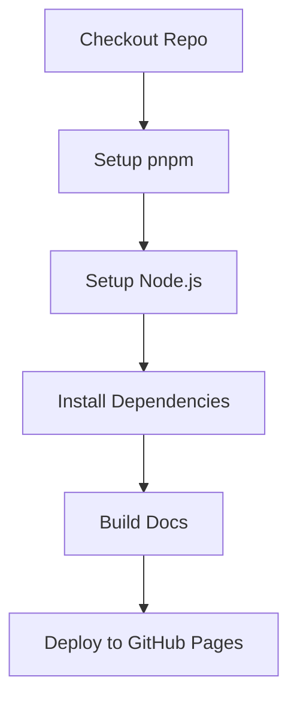

import { Callout } from "nextra/components";
import LocalizedLink from "../../../components/LocalizedLink";

# 📖 Publish Github Pages

このドキュメントは、`.github/workflows/publish-github-pages.yml` GitHub Actions ワークフローの主な動作について説明します。

<Callout type="info">
  このワークフローは `apps/docs` に記述されたドキュメントサイトを GitHub Pages にデプロイします。
  このプロジェクトで GitHub Pages へのデプロイ方法の詳細は、
  <LocalizedLink href="/documentation/publishing-pages">`ドキュメント > ページ公開`</LocalizedLink> をご参照ください。
</Callout>

## ワークフロー概要

このワークフローはドキュメントサイトを GitHub Pages へ自動デプロイします。
主に `main` ブランチに変更が検知された際に実行され、静的サイトをビルドし `gh-pages` ブランチへデプロイします。

- 依存関係のインストールとキャッシュ
- 静的サイトのビルド
- GitHub Pages へのデプロイ

## 実行フロー

### 順次実行

このワークフローは 1 つのジョブで構成されており、以下の順序でステップが実行されます。

## 主なステージの説明

### Checkout Repo

- リポジトリのコードをチェックアウトします。

### Setup pnpm

- pnpm パッケージマネージャーをセットアップします。

### Setup Node.js

- `.nvmrc` ファイルで指定された Node.js バージョンをインストールし、pnpm キャッシュを有効化します。

### Install Dependencies

- `pnpm install --frozen-lockfile` で依存関係をインストールします。

### Build Docs

- ドキュメントサイトを静的にビルドします。
  （例：`pnpm run build` または `pnpm docs:build` など、プロジェクトに合わせたコマンドを使用）

### Deploy to GitHub Pages

- ビルドされた静的ファイルを `gh-pages` ブランチにデプロイし、GitHub Pages でホスティングします。
- `GITHUB_TOKEN` を使ってデプロイ権限を付与します。

このワークフローにより、ドキュメントサイトが自動で最新状態にデプロイされます。
