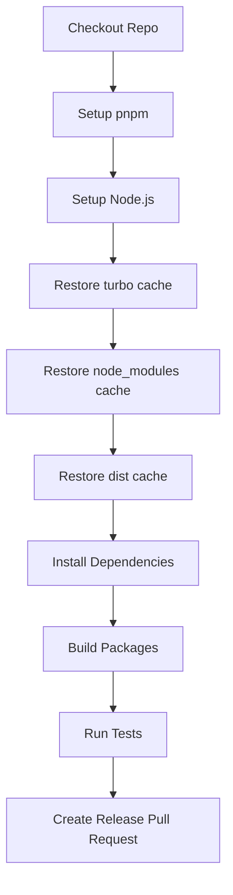

import { Callout } from "nextra/components";
import LocalizedLink from "../../../components/LocalizedLink";

# 🦋 Release

このドキュメントは、`.github/workflows/release.yml` GitHub Actions ワークフローの主な動作について説明します。

<Callout type="info">
  このワークフローは npm パッケージのリリースプロセスを自動化します。
  このプロジェクトで changesets を利用した npm パッケージのリリース方法の詳細は、
  <LocalizedLink href="/packages/versioning-and-publishing">`パッケージ > バージョニングと公開`</LocalizedLink> をご参照ください。
</Callout>

## ワークフロー概要

このワークフローは `main` ブランチへの push をトリガーに自動で実行され、以下のリリースプロセスを自動化します。

- 依存関係やビルド/デプロイ成果物のキャッシュ
- 依存関係のインストールとビルド
- テストの実行
- Changesets によるリリース PR の作成

## 実行フロー

### 順次実行

このワークフローは 1 つのジョブで構成されており、以下の順序でステップが実行されます。

## 主なステージの説明

### Checkout Repo

- リポジトリのコードをチェックアウトします。

### Setup pnpm

- pnpm パッケージマネージャーをセットアップします。

### Setup Node.js

- `.nvmrc` ファイルで指定された Node.js バージョンをインストールし、pnpm キャッシュを有効化します。

### Restore turbo cache

- TurboRepo のビルドキャッシュを復元し、ビルド速度を向上させます。

### Restore node_modules cache

- ルートおよび各ワークスペースの `node_modules` ディレクトリキャッシュを復元します。

### Restore dist cache

- ビルド成果物（`.next`, `dist`, `storybook-static` など）のキャッシュを復元します。

### Install Dependencies

- `pnpm install --frozen-lockfile` で依存関係をインストールします。

### Build Packages

- `pnpm run build` で全パッケージをビルドします。

### Run Tests

- `pnpm run test` でテストを実行します。

### Create Release Pull Request

- Changesets を利用して変更されたパッケージのバージョンを上げ、リリース PR を自動作成します。
- NPM への公開を希望する場合は、関連設定やシークレットを追加することで自動デプロイも可能です。

このワークフローはキャッシュ活用と自動リリース PR 作成により、効率的かつ一貫したリリースプロセスを提供します。
