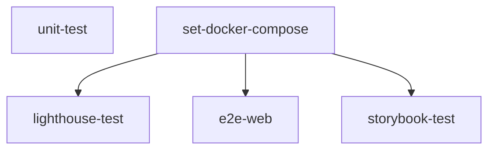

import { Callout } from "nextra/components";
import LocalizedLink from "../../../components/LocalizedLink";

# 🧪 Test

このドキュメントは、`.github/workflows/test.yml` GitHub Actions ワークフローの主な動作について説明します。

<Callout type="info">
  このワークフローはコードが push されると自動で実行され、テストプロセスを自動化します。
  このプロジェクトでテストがどのように実施されているかの詳細は、
  <LocalizedLink href="/testing/testing-environment">`テスト > 自動テスト実行環境`</LocalizedLink> をご参照ください。
</Callout>

## ワークフロー概要

このワークフローはコードが push されると自動で実行され、以下のテストおよびビルドプロセスを自動化します。

- 依存関係のインストールとキャッシュ
- プロジェクトのビルドとテスト
- カバレッジレポートの生成とアップロード
- Docker 環境での Lighthouse、E2E、Storybook テストの実行

## 実行フロー

### 並列実行

このワークフローの各ジョブは並列で実行され、下記の図のような順序で進行します。

## 主なジョブの説明

### unit-test

- 依存関係のインストール、キャッシュの復元、ビルド、ユニットテストを実行します。
- テストカバレッジレポートを生成し、結果ログとともにアーティファクトとしてアップロードします。

### set-docker-compose

- Docker Compose ファイルを変換・キャッシュします。
- 後続ジョブで利用できるよう環境を準備します。

### lighthouse-test

- `set-docker-compose` ジョブの後に実行されます。
- Docker 環境で Lighthouse テストを実行し、Web パフォーマンスをチェックします。

### e2e-web

- `set-docker-compose` ジョブの後に実行されます。
- Playwright を用いた E2E（エンドツーエンド）テストを Docker 環境で実施します。
- テスト結果レポートをアーティファクトとしてアップロードします。

### storybook-test

- `set-docker-compose` ジョブの後に実行されます。
- Storybook および Storybook Test Runner を Docker 環境で実行し、UI コンポーネントのアクセシビリティ（a11y）テストを行います。
- アクセシビリティレポートをアーティファクトとしてアップロードします。

各ジョブは並列または順次で実行され、キャッシュやアーティファクトのアップロードを通じて効率的な CI/CD パイプラインを構築します。
