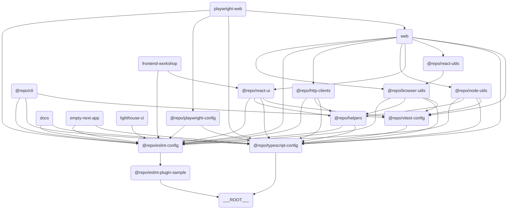

import LocalizedLink from "../../components/LocalizedLink";

# 🧭 概要

## 📖 概要

`turborepo-template`はモノレポ管理とビルドを簡素化するために作成されたテンプレートです。このテンプレートには様々なアプリとパッケージが含まれており、チームのコラボレーションと生産性向上に役立ちます。

## 🗃️ 主な外部パッケージ・ツール依存

このテンプレートは、開発環境の構築やビルドプロセスを簡素化するために、いくつかの外部パッケージやツールに依存しています。主な依存関係は以下の通りです。

| カテゴリ         | パッケージ／ツール名・説明 |
|------------------|---------------------------|
| **パッケージマネージャー** | pnpm                      |
| **モノレポ管理**         | turborepo（turbo）         |
| **言語／トランスパイラ** | typescript                |
| **フォーマッター**       | prettier                  |
| **コミット／フック**     | husky, @commitlint/cli, @commitlint/config-conventional |
| **リンター**             | eslint                    |
| **テスト**               | vitest, @testing-library/react, @testing-library/dom, @testing-library/jest-dom, @testing-library/user-event, jsdom |
| **ビルド／バンドラー**   | next, @vitejs/plugin-react, vite-tsconfig-paths |
| **UIフレームワーク**     | react, react-dom          |
| **E2E／パフォーマンステスト** | playwright, lighthouse, lighthouse-ci |
| **バージョニング**       | changesets                |
| **ドキュメンテーション** | nextra, mdx               |

---

## 🔗 コンポーネント間の関係図

このテンプレートは複数のアプリとパッケージで構成されています。各アプリとパッケージ間の関係は下記のダイアグラムを参照してください。



> 💡 **参考:**
> このダイアグラムは [Mermaid](https://mermaid-js.github.io/mermaid/#/) を使って描かれています。このツールはテキストベースでダイアグラムを作成できます。下記のコードをコピーして [Mermaid Live Editor](https://mermaid-js.github.io/mermaid-live-editor/) に貼り付けると、ダイアグラムを視覚的に確認できます。

## 📦 コンポーネント

### 🖥️ アプリ

このセクションには様々なアプリケーションが含まれています。各アプリは特定の目的のために設計されており、Next.js などの最新技術スタックを活用しています。

- <LocalizedLink href="/apps/sample-apps/empty-next-app">`Empty Next App`</LocalizedLink>: Next.js を使った空のアプリケーションテンプレートです。
- <LocalizedLink href="/apps/sample-apps/web">`Web`</LocalizedLink>: Next.js ベースのウェブアプリケーションです。
- <LocalizedLink href="/apps/sample-apps/frontend-workshop">`Frontend Workshop`</LocalizedLink>: コンポーネント開発とテストのための Storybook 環境です。
- <LocalizedLink href="/apps/sample-apps/docs">`Docs`</LocalizedLink>: 本プロジェクトの Next.js ベースのドキュメントプロジェクトで、Nextra を使って作成されています。

### 📦 パッケージ

このセクションには再利用可能なパッケージのコレクションが含まれています。各パッケージは特定の機能を提供し、モノレポ構造内で独立して管理されます。
また、ここにあるパッケージの一部は [npm](https://npmjs.org) へ公開できるように設定されています。\
(🟢: npm に公開されるパッケージ, 🛑: npm に公開されないパッケージ)

- <LocalizedLink href="/packages/default-packages/browser-utils">🟢 `Browser Utils`</LocalizedLink>: ブラウザ関連のユーティリティ関数集です。
- <LocalizedLink href="/packages/default-packages/eslint-plugin-sample">🟢 `ESLint Plugin Sample`</LocalizedLink>: サンプル ESLint プラグインです。
- <LocalizedLink href="/packages/default-packages/http-clients">🛑 `HTTP Clients`</LocalizedLink>: HTTP リクエストを処理するためのクライアントライブラリです。
- <LocalizedLink href="/packages/default-packages/node-utils">🟢 `Node Utils`</LocalizedLink>: Node.js 環境で使えるユーティリティ関数集です。
- <LocalizedLink href="/packages/default-packages/react-ui">🟢 `React UI`</LocalizedLink>: React ベースの UI コンポーネントライブラリです。
- <LocalizedLink href="/packages/default-packages/react-utils">🟢 `React Utils`</LocalizedLink>: React アプリケーションで使えるユーティリティ関数集です。

### 🧩 Shared

このセクションにはプロジェクト全体で再利用可能な内部パッケージが含まれています。`shared` ディレクトリ内のパッケージは npm には公開されず、内部利用のみです。

- <LocalizedLink href="/shared/shared-codes">`Helpers`</LocalizedLink>: プロジェクト全体で再利用できるユーティリティ関数や共通ロジックを提供する内部パッケージです。

### 🛠️ ツール

このセクションには開発やテストを支援するツールが含まれています。各ツールは特定の作業を自動化または簡素化するのに役立ちます。

- <LocalizedLink href="/tools/playwright-web">`Playwright Web`</LocalizedLink>: Playwright ベースのウェブテストツールです。
- <LocalizedLink href="/tools/clis">`CLI`</LocalizedLink>: コマンドライン作業を自動化し、プロジェクト管理や開発を支援するツールです。
- <LocalizedLink href="/tools/lighthouse-ci">`Lighthouse CI`</LocalizedLink>: ウェブアプリケーションのパフォーマンス、アクセシビリティ、SEO などを自動で測定・管理するツールです。

### ⚙️ 設定

このセクションにはプロジェクト全体で使われる共通設定ファイルが含まれています。ESLint、TypeScript、Vitest などのツールの設定が含まれます。

- <LocalizedLink href="/configs/eslint-config">`ESLint Config`</LocalizedLink>: ESLint 用の共通設定です。
- <LocalizedLink href="/configs/playwright-config">`Playwright Config`</LocalizedLink>: Playwright テストの設定です。
- <LocalizedLink href="/configs/typescript-config">`TypeScript Config`</LocalizedLink>: TypeScript 用の共通設定です。
- <LocalizedLink href="/configs/vitest-config">`Vitest Config`</LocalizedLink>: Vitest テスト用の共通設定です。

## 🔀 ワークフロー

このプロジェクトには以下の GitHub Actions ワークフローが含まれています:

### 🧪 Test

<LocalizedLink href="/cicd/test">`test.yml`</LocalizedLink> ファイルで定義されており、プロジェクトの主なテスト（ユニット、E2E、Lighthouse、Storybook など）を統合的に実行します。
このワークフローには以下のテストが含まれます:\
(🐳は GitHub Actions で Docker コンテナを使って実行されるテストを意味します)

- <LocalizedLink href="/testing/unit-test">`unit test`</LocalizedLink>
- <LocalizedLink href="/testing/e2e-test">🐳 `e2e test`</LocalizedLink>
- <LocalizedLink href="/testing/lighthouse-test">🐳 `lighthouse test`</LocalizedLink>
- <LocalizedLink href="/testing/storybook-test">🐳 `storybook test`</LocalizedLink>

### 🚀 Release

<LocalizedLink href="/cicd/release">`release.yml`</LocalizedLink> ファイルで定義されており、Changesets をベースにパッケージの公開を自動化します。

- このワークフローは Changesets ボットを使って PR を作成し、変更内容を自動で追跡します。
- PR が承認されると、変更されたパッケージのバージョンが更新され、CHANGELOG.md ファイルが生成されます。
- 承認された PR がマージされると、NPM_TOKEN を使って npm へパッケージが公開されます。

### 📖 Publish GitHub Pages

<LocalizedLink href="/cicd/publish-github-pages">`publish-github-pages.yml`</LocalizedLink> ファイルで定義されており、<LocalizedLink href="/docs/apps/docs">docs</LocalizedLink> アプリを GitHub Pages へデプロイします。

## 🐙 GitHub での CI/CD

このプロジェクトはデプロイやテストを自動化するために GitHub の様々な機能を活用しています。主な機能と設定方法は以下の通りです。

### 🐳 GitHub Container Registry

一部の `docker-compose` ベースのワークフロー（例: Storybook、E2E、Lighthouse テスト）では、Docker イメージのビルド時に [GitHub Container Registry(GHCR)](https://ghcr.io/) を利用してイメージレイヤーをキャッシュします。
これによりワークフローの実行速度が向上し、不要なビルドコストを削減できます。

### 📖 GitHub Pages

このプロジェクトは GitHub Pages を使って <LocalizedLink href="/apps/sample-apps/docs">`docs`</LocalizedLink> アプリをデプロイしています。
GitHub Pages のデプロイが正常に動作するには、リポジトリの Settings で Pages を有効にする必要があります。

### 💬 Giscus GitHub App

このプロジェクトは Giscus を使って GitHub Discussions をドキュメントアプリに統合しています。Giscus は GitHub Discussions をベースにしたコメントシステムで、ドキュメントにコメントを残すことができます。

### 🗼 Lighthouse CI GitHub App

Lighthouse テストを正常に動作させるには、GitHub Secrets に `LHCI_GITHUB_APP_TOKEN` 変数を必ず登録してください。
このトークンは Lighthouse CI が GitHub PR と連携して結果を報告したり、ステータスチェックを行う際に必要です。

### 🦋 パッケージのバージョニングと公開

このプロジェクトは [Changesets](https://github.com/changesets/changesets) を使ってパッケージのバージョン管理と公開を簡素化しています。Changesets はモノレポ環境で特に有用で、各パッケージの変更内容を追跡し、それに基づいてバージョンを更新できます。

## ⬇️ 依存関係のインストール

### pnpm のインストール

```bash
pnpm install
```

## 🧑‍💻 使い方

### CLI の利用

`pnpm install` を実行すると、<LocalizedLink href="/tools/clis">`tools/cli`</LocalizedLink> で定義された CLI コマンドをすぐに利用できます。

```bash
example --ls [directory-path]
example --mkdir <directory-name>
example --touch <file-name>
```

### ビルド

```bash
pnpm build
```

### 開発サーバーの起動

```bash
pnpm dev
```

### リモートキャッシュの設定（オプション）

必要に応じて [Turborepo 公式ドキュメント](https://turborepo.com/docs/core-concepts/remote-caching) を参照し、リモートキャッシュを有効化できます。

```bash
npx turbo login
npx turbo link
```

## 🤝 コントリビュート

このテンプレートに貢献する場合は、[CONTRIBUTING.md](./CONTRIBUTING.md) をご参照ください。

## 📜 ライセンス

このプロジェクトは MIT ライセンスの下で配布されています。
