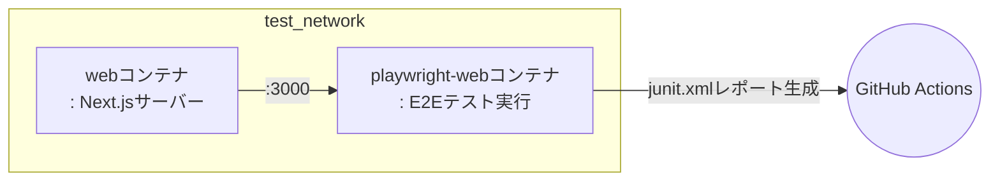

# 🚦 エンドツーエンドテスト

このプロジェクトでは、E2E（エンドツーエンド）テストをCI環境で自動的に実行します。  
以下は、`.github/workflows/test.yml` ワークフローの `e2e-web` ジョブで実行される主な手順です。

## 💻 テスト環境

### 🐳 DockerベースのE2Eテスト

このワークフローはDockerを使用してE2Eテストを実行します。
**Docker Compose**を使い、下記のようにWebサーバーとPlaywrightテストランナーコンテナを起動し、
テスト結果をGitHub Actionsアーティファクトとしてアップロードします。

## 🔄 テストワークフロー

### ステップごとの説明

1. **コードのチェックアウトとキャッシュの復元**
   - ソースコードをチェックアウトし、変換済みdocker-composeファイルをキャッシュから復元します。

2. **GitHub Container Registryへのログイン**
   - E2Eテスト関連イメージのビルドと実行のためにghcr.ioにログインします。

3. **Dockerネットワークの準備**
   - `test_network`という外部Dockerネットワークが存在しない場合は作成します。

4. **E2Eイメージのビルド**
   - `docker-compose.gha.converted.yaml`ファイルを使って、`web`と`playwright-web`の2つのイメージをビルドします。

5. **E2Eテストの実行**
   - `web`および`playwright-web`コンテナを起動し、E2Eテストを実行します。
   - `playwright-web`コンテナ内でテストを実行し、その結果をコンテナ内の`test-results/junit.xml`ファイルに保存します。
   - `playwright-web`コンテナの全プロセスが完了したら、両コンテナを停止します。

6. **E2Eレポートのコピー**
   - テスト完了後、`playwright-web`コンテナ内の`test-results/junit.xml`ファイルをホストにコピーします。

7. **レポートのアップロード**
   - コピーしたE2EレポートをGitHub Actionsアーティファクトとしてアップロードします。

## 🧪 どんなテストが実行されますか？

### Playwright

E2EテストはPlaywrightをベースとしており、  
`tools/playwright-web`ディレクトリ内に定義されたテストスクリプトが実行されます。

- Playwrightは実際のブラウザ環境でユーザーの操作をシミュレートし、全体のフローを検証します。
- テスト結果はJUnit XML形式で生成され、コンテナ内の`test-results/junit.xml`ファイルに保存されます。
- テスト失敗時もワークフローが中断されないように例外処理されます。

つまり、主要なユーザーシナリオに対するE2E自動テストが実行され、その結果がレポートとして残ります。

## 📦 テストアーティファクト

### E2E自動テスト結果

テスト完了後、`playwright-web`コンテナ内の`test-results/junit.xml`ファイルにE2Eテスト結果が保存されます。
この結果はGitHub Actionsアーティファクトとしてアップロードされ、後でダウンロードして確認できます。

#### 目的

このレポートは実際のユーザー視点で主要機能が正常に動作するかを自動で検証し、問題発生時に素早く把握できるようにします。

## 📌 参考

詳細なワークフローは、`.github/workflows/test.yml`ファイルの`e2e-web`ジョブを参照してください。

