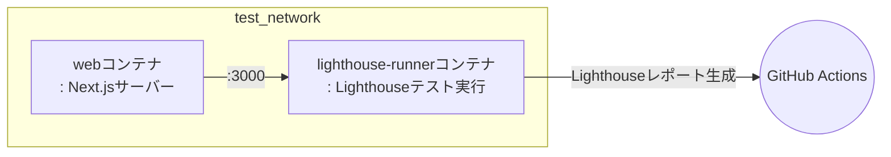

# 🗼 Lighthouseテスト

このプロジェクトでは、LighthouseテストをCI環境で自動的に実行します。
以下は、`.github/workflows/test.yml` ワークフローの `lighthouse-test` ジョブで実行される主な手順です。

## 💻 テスト環境

### 🐳 DockerベースのLighthouseテスト

このワークフローはDockerを使用してLighthouseテストを実行します。
**Docker Compose**を使い、下記のようにWebサーバーとLighthouse CIランナーコンテナを起動し、
テスト結果をGitHub Actionsアーティファクトとしてアップロードします。

## 🔄 テストワークフロー

### ステップごとの説明

1. **コードのチェックアウトとキャッシュの復元**
- ソースコードをチェックアウトし、変換済みdocker-composeファイルをキャッシュから復元します。

2. **GitHub Container Registryへのログイン**
- Lighthouseテスト関連イメージのビルドと実行のためにghcr.ioにログインします。

3. **Dockerネットワークの準備**
- `test_network`という外部Dockerネットワークが存在しない場合は作成します。

4. **Lighthouseイメージのビルド**
- `docker-compose.gha.converted.yaml`ファイルを使って、`web`と`lighthouse-runner`の2つのイメージをビルドします。

5. **Lighthouseテストの実行**
- `web`および`lighthouse-runner`コンテナを起動し、Lighthouseテストを実行します。
- `lighthouse-runner`コンテナ内でテストを実行します。
- `lighthouse-runner`コンテナの全プロセスが完了したら、両コンテナを停止します。

6. **Lighthouseレポートのアップロード**
- `.lighthouserc.cjs`の設定に従い、テスト結果はTemporary Public Storageにアップロードされます。

## 🧪 どんなテストが実行されますか？

### Lighthouse CI

LighthouseテストはLighthouse CIをベースとしており、
`tools/lighthouse-ci`ディレクトリ内に定義された設定に従って実行されます。

- LighthouseはWebページのパフォーマンス、アクセシビリティ、SEO、ベストプラクティスなどを自動で分析します。
- テスト結果はHTMLやJSONなど様々な形式のレポートとして生成され、コンテナ内に保存され、Temporary Public Storageにアップロードされます。
- テスト失敗時もワークフローが中断されないように例外処理されます。

つまり、主要なWebページに対してLighthouse自動分析が実行され、その結果がレポートとして残ります。

## 📦 テストアーティファクト

### Lighthouse自動分析結果

テスト完了後、Lighthouseレポートが生成され、Temporary Public Storageにアップロードされます。

#### 目的

このレポートはWebページのパフォーマンス、アクセシビリティ、SEOなど様々な品質指標を自動で分析し、改善のための情報を提供します。

## 📌 参考

詳細なワークフローは、`.github/workflows/test.yml`ファイルの`lighthouse-test`ジョブを参照してください。

