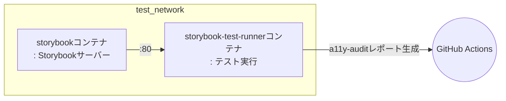

# 📚 Storybookテスト

このプロジェクトでは、StorybookテストをCI環境で自動的に実行します。  
以下は、`.github/workflows/test.yml` ワークフローの `storybook-test` ジョブで実行される主な手順です。

## 💻 テスト環境

### 🐳 DockerベースのStorybookテスト

このワークフローはDockerを使用してStorybookテストを実行します。
**Docker Compose**を使い、下記のようにStorybookサーバーとテストランナーコンテナを起動し、
テスト結果をGitHub Actionsアーティファクトとしてアップロードします。

## 🔄 テストワークフロー

### ステップごとの説明

1. **コードのチェックアウトとキャッシュの復元**
- ソースコードをチェックアウトし、変換済みdocker-composeファイルをキャッシュから復元します。

2. **GitHub Container Registryへのログイン**
- Storybook関連イメージのビルドと実行のためにghcr.ioにログインします。

3. **Dockerネットワークの準備**
- `test_network`という外部Dockerネットワークが存在しない場合は作成します。

4. **Storybookイメージのビルド**
- `docker-compose.gha.converted.yaml`ファイルを使って、`storybook`と`storybook-test-runner`の2つのイメージをビルドします。

5. **Storybookテストの実行**
- `storybook`および`storybook-test-runner`コンテナを起動し、Storybookテストを実行します。
- `storybook-test-runner`コンテナ内でテストを実行し、その結果をコンテナ内の`a11y-audit`ディレクトリに保存します。
- `storybook-test-runner`コンテナの全プロセスが完了したら、両コンテナを停止します。

6. **アクセシビリティ(A11y)レポートのコピー**
- テスト完了後、`storybook-test-runner`コンテナ内のアクセシビリティ監査結果（`a11y-audit`フォルダ）をホストにコピーします。

7. **レポートのアップロード**
- コピーしたアクセシビリティレポートをGitHub Actionsアーティファクトとしてアップロードします。

## 🧪 どんなテストが実行されますか？

### axe-playwright

Storybookテストは、`apps/frontend-workshop/.storybook/test-runner.ts`ファイルで定義された設定に従って実行されます。  
この設定では**axe-playwright**を利用し、各Storybookストーリーに対してアクセシビリティ（A11y）の自動監査を行います。

- テストランナーは各ストーリーを訪問する前に`axe-core`をページに注入し、ストーリーのa11yパラメータに従ってルールを設定します。
- 各ストーリーの特定要素（デフォルトは`body`）を対象にアクセシビリティ監査を実行します。
- 監査結果はJUnit XML形式で生成され、コンテナ内の`test-results/a11y-audit`フォルダに保存されます。
- テスト失敗時もワークフローが中断されないように例外処理されます。

つまり、すべてのStorybookコンポーネントに対してaxeベースのアクセシビリティ自動テストが実行され、その結果がレポートとして残ります。

## 📦 テストアーティファクト

### アクセシビリティ(A11y)自動監査結果

テスト完了後、`storybook-test-runner`コンテナ内の`a11y-audit`フォルダにアクセシビリティ監査結果が保存されます。
この結果はGitHub Actionsアーティファクトとしてアップロードされ、後でダウンロードして確認できます。

#### 目的

このレポートはStorybookコンポーネントのアクセシビリティ問題を自動で検出し、改善のための情報を提供します。

## 📌 参考

詳細なワークフローは、`.github/workflows/test.yml`ファイルの`storybook-test`ジョブを参照してください。

