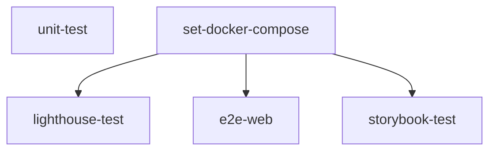

# 🤖 自動化テスト実行環境

このプロジェクトは GitHub Actions を利用して自動化されたテスト環境を提供します。
これはコードがマージされデプロイされるまでの過程で様々なテストを実行し、コードの品質を維持し、
デプロイ前に問題が発生しないよう事前に検知・解決するためです。

## 🔄 ワークフロー構成（`.github/workflows/test.yml`）

このワークフローは様々なテストジョブで構成されており、それぞれのジョブは以下の役割を持ちます。

### 要約

### 1. `unit-test`
- **依存関係のインストール、ビルド、ユニットテスト、カバレッジレポート生成**を担当します。
- Turbo、node_modules、dist、テストカバレッジなど様々なキャッシュを活用し、ビルド/テスト速度を向上させます。
- テスト結果やカバレッジレポート、ビルド/テストログをアーティファクトとしてアップロードします。

### 2. `set-docker-compose`
- Dockerベースの統合テスト環境用に `docker-compose.gha.yaml` ファイルを変換・キャッシュします。
- 以降の E2E、Lighthouse、Storybook テストで共通して利用されます。

### 3. `lighthouse-test`
- Webアプリと Lighthouse テスト用イメージを Docker でビルドし、Lighthouse CI で Web アクセシビリティ・パフォーマンス・SEO などを自動チェックします。
- temporary-public-storage にテスト結果をアップロードし、レポートを PR に添付します。

### 4. `e2e-web`
- Webアプリと Playwright ベースの E2E テストイメージを Docker でビルドし、実際のブラウザ環境で統合テストを実施します。
- テスト結果（junit.xml）をアーティファクトとしてアップロードします。

### 5. `storybook-test`
- Storybook および Storybook テストランナーイメージを Docker でビルドし、Storybook ベースの UI コンポーネントアクセシビリティ/テストを自動化します。
- アクセシビリティレポート（a11y-audit）をアーティファクトとしてアップロードします。

## 🔁 自動化フローの概要

1. **ユニットテスト**：コード変更時に最初に実行され、素早いフィードバックを提供します。
2. **Docker環境準備**：統合テスト用の docker-compose ファイルを変換・キャッシュします。
3. **統合テスト**：E2E、Lighthouse、Storybook テストが並列で実行され、実サービス環境に近い形で検証します。
4. **アーティファクトアップロード**：各テスト成果物（カバレッジ、レポート等）は GitHub Actions のアーティファクトとしてアップロードされ、後から確認できます。

## 💾 キャッシュ戦略

- **Turbo、node_modules、dist、テストカバレッジ、docker-compose 変換ファイル** など様々なキャッシュを積極的に活用し、ワークフロー実行速度を最適化します。

## 🐳 Dockerベースの統合テスト環境

- E2E、Lighthouse、Storybook テストは実サービスに近い環境を Docker コンテナで構築し、高い信頼性のテストを保証します。
- docker-compose ファイル（`docker-compose.gha.yaml`）を使い、必要なサービス（Web、Playwright、Lighthouse、Storybook など）をコンテナで起動します。
- 各テストコンテナは専用ネットワーク（`test_network`）上で実行され、サービス間通信が円滑に行われます。

## 📌 参考

- 各ジョブの詳細スクリプトや設定は `.github/workflows/test.yml` ファイルを参照してください。
- テスト成果物は GitHub Actions の「Artifacts」からダウンロードできます。
