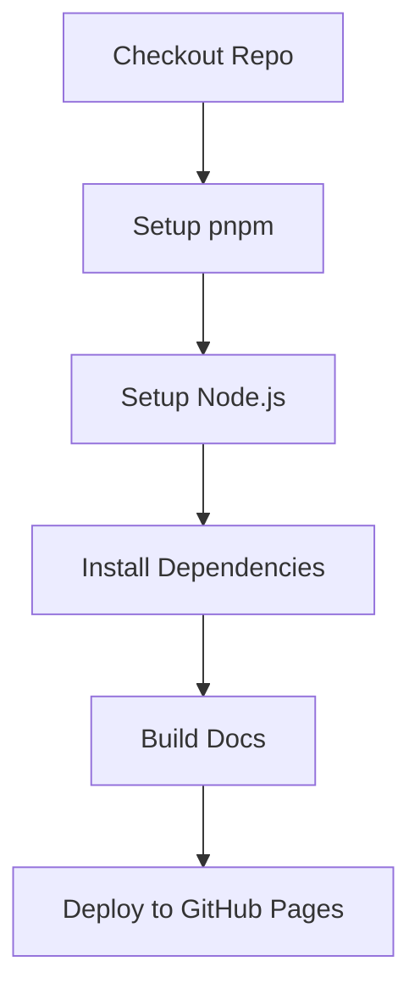

import { Callout } from "nextra/components";
import LocalizedLink from "../../../components/LocalizedLink";

# 📖 Publish Github Pages

이 문서는 `.github/workflows/publish-github-pages.yml` GitHub Actions 워크플로우의 주요 동작을 설명합니다.

<Callout type="info">
  이 워크플로우는 `apps/docs`에 작성된 문서 사이트를 GitHub Pages 로 배포합니다.
  이 프로젝트에서 GitHub Pages 로 어떻게 배포하는지에 대한 자세한 내용은
  <LocalizedLink href="/documentation/publishing-pages">`문서화 > 문서 페이지 배포`</LocalizedLink> 문서를 참고하세요.
</Callout>

## 워크플로우 개요

이 워크플로우는 문서 사이트를 GitHub Pages로 자동 배포합니다.
주로 `main` 브랜치에 변경이 감지될 때 실행되며, 정적 사이트를 빌드하고 `gh-pages` 브랜치로 배포합니다.

- 의존성 설치 및 캐싱
- 정적 사이트 빌드
- GitHub Pages로 배포

## 실행 방식

### 순차 실행

이 워크플로우는 하나의 잡(job)으로 구성되어 있으며, 아래와 같은 순서로 단계별로 실행됩니다.

## 주요 단계(Stage) 설명

### Checkout Repo

- 저장소의 코드를 체크아웃합니다.

### Setup pnpm

- pnpm 패키지 매니저를 설정합니다.

### Setup Node.js

- `.nvmrc` 파일에 명시된 Node.js 버전을 설치하고, pnpm 캐시를 활성화합니다.

### Install Dependencies

- `pnpm install --frozen-lockfile`로 의존성을 설치합니다.

### Build Docs

- 문서 사이트를 정적으로 빌드합니다.
  (예: `pnpm run build` 또는 `pnpm docs:build` 등 프로젝트에 맞는 명령어 사용)

### Deploy to GitHub Pages

- 빌드된 정적 파일을 `gh-pages` 브랜치로 배포하여 GitHub Pages에서 호스팅합니다.
- `GITHUB_TOKEN`을 사용해 배포 권한을 부여합니다.

이 워크플로우를 통해 문서 사이트가 자동으로 최신 상태로 배포됩니다.
