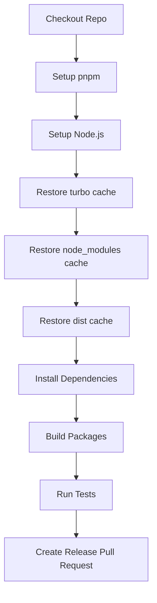

import { Callout } from "nextra/components";
import LocalizedLink from "../../../components/LocalizedLink";

# 🦋 Release

이 문서는 `.github/workflows/release.yml` GitHub Actions 워크플로우의 주요 동작을 설명합니다.

<Callout type="info">
  이 워크플로우는 npm 패키지의 릴리즈 과정을 자동화합니다.
  이 프로젝트에서 changesets 를 이용한 npm 패키지를 릴리즈 과정이 어떻게 진행되는지에 대한 보다 자세한 내용은
  <LocalizedLink href="/packages/versioning-and-publishing">`패키지 > 버저닝 및 배포`</LocalizedLink> 문서를 참고하세요.
</Callout>

## 워크플로우 개요

이 워크플로우는 `main` 브랜치에 push가 발생할 때 자동으로 실행되며, 다음과 같은 릴리즈 과정을 자동화합니다.

- 의존성 및 빌드/배포 산출물 캐싱
- 의존성 설치 및 빌드
- 테스트 실행
- Changesets를 통한 릴리즈 PR 생성

## 실행 방식

### 순차 실행

이 워크플로우는 하나의 잡(job)으로 구성되어 있으며, 아래와 같은 순서로 단계별로 실행됩니다.

## 주요 단계(Stage) 설명

### Checkout Repo

- 저장소의 코드를 체크아웃합니다.

### Setup pnpm

- pnpm 패키지 매니저를 설정합니다.

### Setup Node.js

- `.nvmrc` 파일에 명시된 Node.js 버전을 설치하고, pnpm 캐시를 활성화합니다.

### Restore turbo cache

- TurboRepo 빌드 캐시를 복원하여 빌드 속도를 높입니다.

### Restore node_modules cache

- 루트 및 각 워크스페이스의 `node_modules` 디렉터리 캐시를 복원합니다.

### Restore dist cache

- 빌드 산출물(`.next`, `dist`, `storybook-static` 등) 캐시를 복원합니다.

### Install Dependencies

- `pnpm install --frozen-lockfile`로 의존성을 설치합니다.

### Build Packages

- `pnpm run build`로 전체 패키지를 빌드합니다.

### Run Tests

- `pnpm run test`로 테스트를 실행합니다.

### Create Release Pull Request

- Changesets를 이용해 변경된 패키지의 버전을 올리고, 릴리즈 PR을 자동 생성합니다.
- NPM 배포를 원할 경우, 관련 설정 및 시크릿을 추가하면 자동 배포도 가능합니다.

이 워크플로우는 캐시 활용과 자동화된 릴리즈 PR 생성을 통해 효율적이고 일관된 릴리즈 프로세스를 제공합니다.
