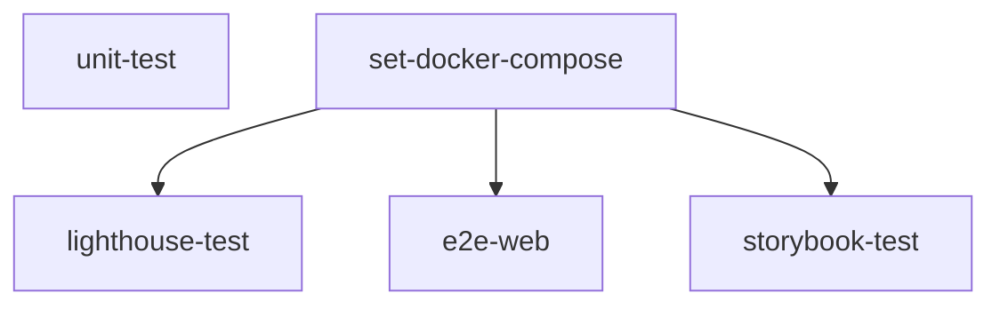

import { Callout } from "nextra/components";
import LocalizedLink from "../../../components/LocalizedLink";

# 🧪 Test

이 문서는 `.github/workflows/test.yml` GitHub Actions 워크플로우의 주요 동작을 설명합니다.

<Callout type="info">
  이 워크플로우는 코드가 push될 때 자동으로 실행되며, 테스트 과정을 자동화합니다.
  이 프로젝트에서 테스트가 어떻게 진행되는지에 대한 보다 자세한 내용은
  <LocalizedLink href="/testing/testing-environment">`테스팅 > 자동화된 테스트 실행 환경`</LocalizedLink> 문서를 참고하세요.
</Callout>

## 워크플로우 개요

이 워크플로우는 코드가 push될 때 자동으로 실행되며, 다음과 같은 테스트 및 빌드 과정을 자동화합니다.

- 의존성 설치 및 캐싱
- 프로젝트 빌드 및 테스트
- 커버리지 리포트 생성 및 업로드
- Docker 환경에서 Lighthouse, E2E, Storybook 테스트 수행

## 실행 방식

### 병렬 실행

이 워크플로우의 각 job 은 병렬로 실행되며, 아래 도표와 같은 순서로 진행됩니다.

## 주요 잡(Job) 설명

### unit-test

- 의존성 설치, 캐시 복원, 빌드, 유닛 테스트를 실행합니다.
- 테스트 커버리지 리포트를 생성하고, 결과 로그와 함께 아티팩트로 업로드합니다.

### set-docker-compose

- Docker Compose 파일을 변환 및 캐싱합니다.
- 이후 잡에서 사용할 수 있도록 환경을 준비합니다.

### lighthouse-test

- `set-docker-compose` 잡 이후 실행됩니다.
- Docker 환경에서 Lighthouse 테스트를 실행하여 웹 성능을 점검합니다.

### e2e-web

- `set-docker-compose` 잡 이후 실행됩니다.
- Playwright를 이용한 E2E(End-to-End) 테스트를 Docker 환경에서 수행합니다.
- 테스트 결과 리포트를 아티팩트로 업로드합니다.

### storybook-test

- `set-docker-compose` 잡 이후 실행됩니다.
- Storybook 및 Storybook Test Runner를 Docker 환경에서 실행하여 UI 컴포넌트의 접근성(a11y) 테스트를 수행합니다.
- 접근성 리포트를 아티팩트로 업로드합니다.

각 잡은 병렬 또는 순차적으로 실행되며, 캐시 및 아티팩트 업로드를 통해 효율적인 CI/CD 파이프라인을 구성합니다.
