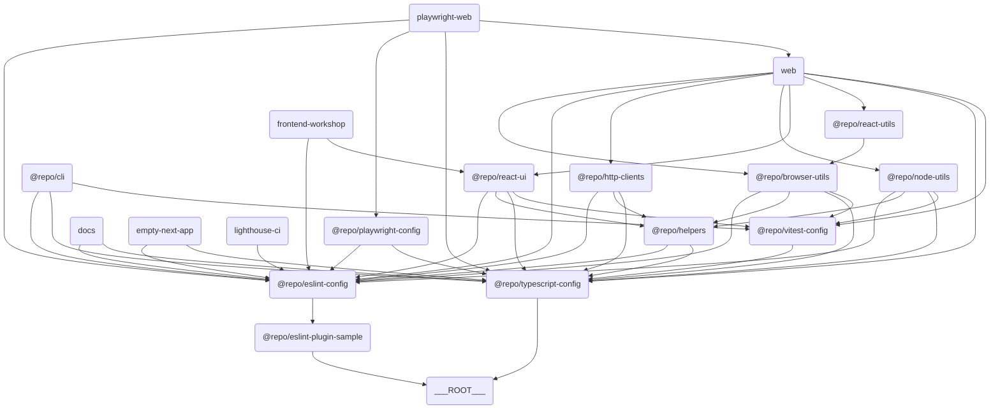

# 🧭 Overview

[](https://github.com/iamhoonse-dev/turborepo-template/actions/workflows/test.yml)
[](https://github.com/iamhoonse-dev/turborepo-template/actions/workflows/release.yml)
[](https://github.com/iamhoonse-dev/turborepo-template/actions/workflows/publish-github-pages.yml)

## 📖 개요

`turborepo-template`은 모노레포 관리랑 빌드를 단순화하려고 만든 템플릿이에요. 이 템플릿은 다양한 앱과 패키지를 포함하고 있어서, 팀 협업과 생산성을 높이는 데 도움을 줄 거예요.

## 🔗 구성 요소 간 관계도

이 템플릿은 여러 앱과 패키지로 구성돼 있어요. 각 앱과 패키지 간의 관계는 아래의 다이어그램을 참고해 주세요.



> 💡 **참고:**
> 이 다이어그램은 [Mermaid](https://mermaid-js.github.io/mermaid/#/)를 사용해서 그렸어요. 이 도구는 텍스트 기반으로 다이어그램을 그릴 수 있게 해줘요. 아래의 코드를 복사해서 [Mermaid Live Editor](https://mermaid-js.github.io/mermaid-live-editor/)에 붙여넣으면 다이어그램을 시각적으로 확인할 수 있어요.

## 📦 구성 요소

### 🖥️ Apps

이 섹션은 다양한 애플리케이션을 포함하고 있어요. 각 앱은 특정 목적을 위해 설계되었으며, Next.js와 같은 최신 기술 스택을 활용하고 있어요.

- **[Empty Next App](./apps/empty-next-app)**: Next.js를 사용한 빈 애플리케이션 템플릿이에요.
- **[Web](./apps/web)**: Next.js 기반의 웹 애플리케이션이에요.
- **[Frontend Workshop](./apps/frontend-workshop)**: 컴포넌트 개발이랑 테스트를 위한 Storybook 환경이에요.
- **[Docs](./apps/docs)**: 본 프로젝트에 대한 Next.js 기반의 문서화 프로젝트로, [Nextra](https://nextra.site/)를 사용해서 작성되었어요.

### 📦 Packages

이 섹션은 재사용 가능한 패키지 모음을 포함하고 있어요. 각 패키지는 특정 기능을 제공하며, 모노레포 구조에서 독립적으로 관리돼요.
또한, 이곳에 있는 패키지들 중 일부는 [npm](https://npmjs.org)에 배포될 수 있도록 설정되어 있어요.

- **[Browser Utils](./packages/browser-utils)**: 브라우저 관련 유틸리티 함수 모음이에요.
- 🟢 [npm](https://npmjs.org) 에 배포되도록 설정되어 있어요.
- **[ESLint Plugin Sample](./packages/eslint-plugin-sample)**: 샘플 ESLint 플러그인이에요.
- 🟢 [npm](https://npmjs.org) 에 배포되도록 설정되어 있어요.
- **[HTTP Clients](./packages/http-clients)**: HTTP 요청을 처리하려고 만든 클라이언트 라이브러리예요.
- 🛑 [npm](https://npmjs.org) 에 배포되지 않도록 설정되어 있어요.
- **[Node Utils](./packages/node-utils)**: Node.js 환경에서 쓸 수 있는 유틸리티 함수 모음이에요.
- 🟢 [npm](https://npmjs.org) 에 배포되도록 설정되어 있어요.
- **[React UI](./packages/react-ui)**: React 기반 UI 컴포넌트 라이브러리예요.
- 🟢 [npm](https://npmjs.org) 에 배포되도록 설정되어 있어요.
- **[React Utils](./packages/react-utils)**: React 애플리케이션에서 쓸 수 있는 유틸리티 함수 모음이에요.
- 🟢 [npm](https://npmjs.org) 에 배포되도록 설정되어 있어요.

### 🧩 Shared

이 섹션은 프로젝트 전반에서 재사용 가능한 내부 패키지를 포함하고 있어요. `shared` 디렉토리에 있는 패키지들은 npm에 배포되지 않고, 내부적으로만 사용돼요.

- **[Helpers](./shared/helpers)**: 프로젝트 전반에서 재사용 가능한 유틸리티 함수와 공통 로직을 제공하는 내부 패키지예요.

### 🛠️ Tools

이 섹션은 개발 및 테스트를 지원하는 도구들을 포함하고 있어요. 각 도구는 특정 작업을 자동화하거나 간소화하는 데 도움을 줘요.

- **[Playwright Web](./tools/playwright-web)**: Playwright 기반의 웹 테스트 도구예요.
- **[CLI](./tools/cli)**: 명령줄 작업을 자동화하고 프로젝트 관리 및 개발을 지원하기 위한 도구예요.
- **[Lighthouse CI](./tools/lighthouse-ci)**: 웹 애플리케이션의 성능, 접근성, SEO 등을 자동으로 측정하고 관리하기 위한 도구예요.

### ⚙️ Configs

이 섹션은 프로젝트 전반에서 사용되는 공통 설정 파일들을 포함하고 있어요. ESLint, TypeScript, Vitest와 같은 도구들의 설정이 포함돼요.

- **[ESLint Config](./configs/eslint-config)**: ESLint 설정을 위한 공통 구성이에요.
- **[Playwright Config](./configs/playwright-config)**: Playwright 테스트 설정이에요.
- **[TypeScript Config](./configs/typescript-config)**: TypeScript 설정을 위한 공통 구성이에요.
- **[Vitest Config](./configs/vitest-config)**: Vitest 테스트 설정을 위한 공통 구성이에요.

## 🔀 Workflows

이 프로젝트는 다음과 같은 GitHub Actions Workflow를 포함하고 있어요:

### 🧪 **[Test](.github/workflows/test.yml)**

[`test.yml`](.github/workflows/test.yml) 파일에 정의되어 있으며, 프로젝트의 주요 테스트(유닛, E2E, Lighthouse, Storybook 등)를 통합적으로 실행해요.

- 이 Workflow는 다음과 같은 테스트를 포함해요:
- [unit test](.github/workflows/test.yml#L13)
- [e2e test](.github/workflows/test.yml#L167)
- [lighthouse test](.github/workflows/test.yml#L139)
- [storybook test](.github/workflows/test.yml#L209)
- 이들 중 e2e, lighthouse, storybook 테스트는 [`docker-compose.gha.yaml`](./docker-compose.gha.yaml) 파일을 사용해서 통합 테스트 환경을 설정해요.
- 다양한 서비스(web, playwright, lighthouse, storybook 등)를 컨테이너로 띄워 실제 서비스 환경과 유사하게 테스트를 수행해요.

### 🚀 **[Release](.github/workflows/release.yml)**

[`release.yml`](.github/workflows/release.yml) 파일에 정의되어 있으며, Changesets를 기반으로 패키지 배포를 자동화해요.

- 이 Workflow는 Changesets 봇을 사용해서 PR을 생성하고, 변경 사항을 자동으로 추적해요.
- PR을 승인하면, 변경된 패키지의 버전이 업데이트되고, `CHANGELOG.md` 파일이 생성돼요.
- 그리고 승인된 PR이 병합되면서 실행되는 Workflow에 의해, `NPM_TOKEN`을 사용하여 npm에 패키지가 배포돼요.

### 📖 [Publish GitHub Pages](.github/workflows/publish-github-pages.yml)

[`publish-github-pages.yml`](.github/workflows/publish-github-pages.yml) 파일에 정의되어 있으며, [`docs`](./apps/docs) 앱을 GitHub Pages에 배포해요.

## 🐳 GitHub Container Registry 사용

일부 `docker-compose` 기반 워크플로우(예: Storybook, E2E, Lighthouse 테스트)에서는 Docker 이미지 빌드 시 [GitHub Container Registry(GHCR)](https://ghcr.io/)를 활용해서 이미지 레이어를 캐싱해요.
이렇게 하면 워크플로우 실행 속도를 높이고, 불필요한 빌드 비용을 줄일 수 있어요.

## 📖 GitHub Pages 사용

이 프로젝트는 GitHub Pages를 사용해서 [`docs`](./apps/docs) 앱을 배포하고 있어요.
GitHub Pages 배포가 정상적으로 동작하려면 Settings에서 Pages를 활성화해야 해요.

## 💬 Giscus GitHub App 사용

이 프로젝트는 Giscus를 사용해서 GitHub Discussions을 문서화 앱에 통합하고 있어요. Giscus는 GitHub Discussions를 기반으로 하는 댓글 시스템으로, 문서에 댓글을 달 수 있게 해줘요.

## 🗼 Lighthouse CI GitHub App 사용

Lighthouse 테스트가 정상적으로 동작하려면 GitHub Secrets에 `LHCI_GITHUB_APP_TOKEN` 변수를 반드시 등록해야 해요.
이 토큰은 Lighthouse CI가 GitHub PR과 연동되어 결과를 보고하거나 상태 체크를 수행할 때 필요해요.

## 🦋 패키지 버저닝 및 배포

이 프로젝트는 [Changesets](https://github.com/changesets/changesets)를 사용하여 패키지 버전 관리와 배포를 간소화하고 있어요. Changesets는 모노레포 환경에서 특히 유용하며, 각 패키지의 변경 사항을 추적하고 이를 기반으로 버전을 업데이트할 수 있도록 도와줘요.

## ⬇️ 의존성 설치

### pnpm 설치

```bash
pnpm install
```

## 🧑‍💻 사용법

### CLI 사용

`pnpm install`을 실행하면 [`tools/cli`](./tools/cli)에 정의된 CLI 명령어들을 바로 사용할 수 있어요.

```bash
example --ls [directory-path]
example --mkdir <directory-name>
example --touch <file-name>
```

### 빌드

```bash
pnpm build
```

### 개발 서버 실행

```bash
pnpm dev
```

### 원격 캐싱 설정 (Optional)

필요에 따라 [Turborepo 공식 문서](https://turborepo.com/docs/core-concepts/remote-caching)를 참고하여 원격 캐싱을 사용하도록 설정할 수 있어요.

```bash
npx turbo login
npx turbo link
```

## 🤝 기여

이 템플릿에 기여하려면, [CONTRIBUTING.md](./CONTRIBUTING.md)를 참고해 주세요.

## 📜 라이선스

이 프로젝트는 MIT 라이선스 하에 배포돼요.
