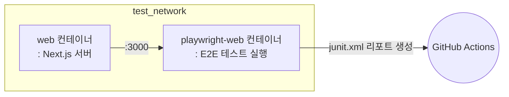

# 🚦 End-to-end 테스트

이 프로젝트에서는 E2E(End-to-end) 테스트를 CI 환경에서 자동으로 실행합니다.  
아래는 `.github/workflows/test.yml` 워크플로우의 `e2e-web` job에서 수행하는 주요 단계입니다.

## 💻 테스트 환경

### 🐳 Docker 기반 E2E 테스트

이 워크플로우는 Docker를 사용하여 E2E 테스트를 실행합니다.
**Docker Compose**를 사용하여 아래와 같이 웹 서버와 Playwright 테스트 러너 컨테이너를 실행하고,
테스트 결과를 GitHub Actions 아티팩트로 업로드합니다.

## 🔄 테스트 워크플로우

### 단계별 설명

1. **코드 체크아웃 및 캐시 복원**
   - 소스 코드를 체크아웃하고, 변환된 docker-compose 파일 캐시를 복원합니다.

2. **GitHub Container Registry 로그인**
   - E2E 테스트 관련 이미지를 빌드 및 실행하기 위해 ghcr.io에 로그인합니다.

3. **도커 네트워크 준비**
   - `test_network`라는 외부 도커 네트워크가 없으면 생성합니다.

4. **E2E 이미지 빌드**
   - `docker-compose.gha.converted.yaml` 파일을 사용하여 `web` 및 `playwright-web` 2개의 이미지를 빌드합니다.

5. **E2E 테스트 실행**
   - `web`과 `playwright-web` 컨테이너를 실행하여 E2E 테스트를 수행합니다.
   - `playwright-web` 컨테이너에서 테스트를 실행하고 그 결과를 컨테이너 내부의 `test-results/junit.xml` 파일에 저장합니다.
   - `playwright-web` 컨테이너의 모든 프로세스가 완료되면 두 컨테이너를 중지합니다.

6. **E2E 리포트 복사**
   - 테스트가 완료된 후, `playwright-web` 컨테이너 내부의 `test-results/junit.xml` 파일을 호스트로 복사합니다.

7. **리포트 업로드**
   - 복사한 E2E 리포트를 GitHub Actions 아티팩트로 업로드합니다.

## 🧪 어떤 테스트가 실행되나요?

### Playwright

E2E 테스트는 Playwright를 기반으로 하며,  
`tools/playwright-web` 디렉토리 내에 정의된 테스트 스크립트가 실행됩니다.

- Playwright는 실제 브라우저 환경에서 사용자의 행동을 시뮬레이션하여 전체 플로우를 검증합니다.
- 테스트 결과는 JUnit XML 형식으로 생성되어, 컨테이너 내부의 `test-results/junit.xml` 파일에 저장됩니다.
- 테스트 실패 시에도 워크플로우가 중단되지 않도록 예외를 처리합니다.

즉, 주요 사용자 시나리오에 대한 E2E 자동 테스트가 실행되고, 그 결과가 리포트로 남습니다.

## 📦 테스트 아티팩트

### E2E 자동 테스트 결과

테스트가 완료되면 `playwright-web` 컨테이너 내부의 `test-results/junit.xml` 파일에 E2E 테스트 결과가 저장됩니다.
이 결과는 GitHub Actions 아티팩트로 업로드되어, 나중에 다운로드하여 확인할 수 있습니다.

#### 목적

이 리포트는 실제 사용자 관점에서 주요 기능의 정상 동작 여부를 자동으로 검증하고, 문제 발생 시 빠르게 파악할 수 있도록 도와줍니다.

## 📌 참고

자세한 워크플로우는 `.github/workflows/test.yml` 파일의 `e2e-web` 잡을 참고하세요.

