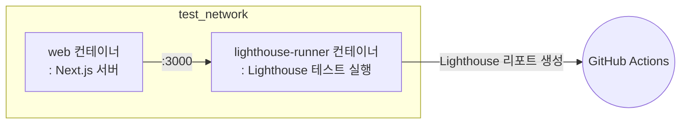

# 🗼 Lighthouse 테스트

이 프로젝트에서는 Lighthouse 테스트를 CI 환경에서 자동으로 실행합니다.  
아래는 `.github/workflows/test.yml` 워크플로우의 `lighthouse-test` job에서 수행하는 주요 단계입니다.

## 💻 테스트 환경

### 🐳 Docker 기반 Lighthouse 테스트

이 워크플로우는 Docker를 사용하여 Lighthouse 테스트를 실행합니다.
**Docker Compose**를 사용하여 아래와 같이 웹 서버와 Lighthouse CI 러너 컨테이너를 실행하고,
테스트 결과를 GitHub Actions 아티팩트로 업로드합니다.

## 🔄 테스트 워크플로우

### 단계별 설명

1. **코드 체크아웃 및 캐시 복원**
   - 소스 코드를 체크아웃하고, 변환된 docker-compose 파일 캐시를 복원합니다.

2. **GitHub Container Registry 로그인**
   - Lighthouse 테스트 관련 이미지를 빌드 및 실행하기 위해 ghcr.io에 로그인합니다.

3. **도커 네트워크 준비**
   - `test_network`라는 외부 도커 네트워크가 없으면 생성합니다.

4. **Lighthouse 이미지 빌드**
   - `docker-compose.gha.converted.yaml` 파일을 사용하여 `web` 및 `lighthouse-runner` 2개의 이미지를 빌드합니다.

5. **Lighthouse 테스트 실행**
   - `web`과 `lighthouse-runner` 컨테이너를 실행하여 Lighthouse 테스트를 수행합니다.
   - `lighthouse-runner` 컨테이너에서 테스트를 실행합니다.
   - `lighthouse-runner` 컨테이너의 모든 프로세스가 완료되면 두 컨테이너를 중지합니다.

6. **Lighthouse 리포트 업로드**
   - 테스트 결과는 `.lighthouserc.cjs` 설정에 따라 Temporary Public Storage 에 업로드됩니다.

## 🧪 어떤 테스트가 실행되나요?

### Lighthouse CI

Lighthouse 테스트는 Lighthouse CI를 기반으로 하며,  
`tools/lighthouse-ci` 디렉토리 내에 정의된 설정에 따라 실행됩니다.

- Lighthouse는 웹 페이지의 성능, 접근성, SEO, 베스트 프랙티스 등을 자동으로 분석합니다.
- 테스트 결과는 HTML, JSON 등 다양한 형식의 리포트로 생성되어 컨테이너 내부에 저장되고, Temporary Public Storage 에 업로드됩니다.
- 테스트 실패 시에도 워크플로우가 중단되지 않도록 예외를 처리합니다.

즉, 주요 웹 페이지에 대한 Lighthouse 자동 분석이 실행되고, 그 결과가 리포트로 남습니다.

## 📦 테스트 아티팩트

### Lighthouse 자동 분석 결과

테스트가 완료되면 Lighthouse 리포트가 생성되어 Temporary Public Storage 에 업로드됩니다.
그리고 PR(Pull Request)의 Check 결과에 연동되어, 웹 페이지의 품질 지표를 확인할 수 있습니다.

#### 목적

이 리포트는 웹 페이지의 성능, 접근성, SEO 등 다양한 품질 지표를 자동으로 분석하고, 개선할 수 있는 정보를 제공합니다.

## 📌 참고

자세한 워크플로우는 `.github/workflows/test.yml` 파일의 `lighthouse-test` 잡을 참고하세요.
