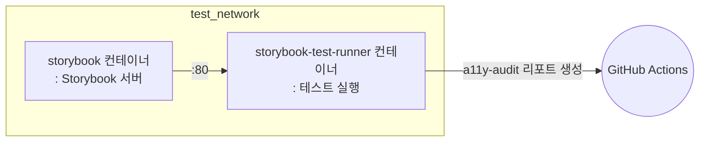

# 📚 Storybook 테스트

이 프로젝트에서는 Storybook 테스트를 CI 환경에서 자동으로 실행합니다.  
아래는 `.github/workflows/test.yml` 워크플로우의 `storybook-test` job 에서 수행하는 주요 단계입니다.

## 💻 테스트 환경

### 🐳 Docker 기반 Storybook 테스트

이 워크플로우는 Docker를 사용하여 Storybook 테스트를 실행합니다.
**Docker Compose**를 사용하여 아래와 같이 Storybook 서버와 테스트 러너 컨테이너를 실행하고,
테스트 결과를 GitHub Actions 아티팩트로 업로드합니다.

## 🔄 테스트 워크플로우

### 단계별 설명

1. **코드 체크아웃 및 캐시 복원**
   - 소스 코드를 체크아웃하고, 변환된 docker-compose 파일 캐시를 복원합니다.

2. **GitHub Container Registry 로그인**
   - Storybook 관련 이미지를 빌드 및 실행하기 위해 ghcr.io에 로그인합니다.

3. **도커 네트워크 준비**
   - `test_network`라는 외부 도커 네트워크가 없으면 생성합니다.

4. **Storybook 이미지 빌드**
   - `docker-compose.gha.converted.yaml` 파일을 사용하여 `storybook` 및 `storybook-test-runner` 2 개의 이미지를 빌드합니다.

5. **Storybook 테스트 실행**
   - `storybook`과 `storybook-test-runner` 컨테이너를 실행하여 Storybook 테스트를 수행합니다.
   - `storybook-test-runner` 컨테이너에서 테스트를 실행하고 그 결과를 컨테이너 내부의 `a11y-audit` 디렉토리에 저장합니다.
   - `storybook-test-runner` 컨테이너의 모든 프로세스가 완료되면 `storybook`과 `storybook-test-runner` 컨테이너를 중지합니다.

6. **접근성(A11y) 리포트 복사**
   - 테스트가 완료된 후, `storybook-test-runner` 컨테이너 내부의 접근성 감사 결과(`a11y-audit` 폴더)를 호스트로 복사합니다.

7. **리포트 업로드**
   - 복사한 접근성 리포트를 GitHub Actions 아티팩트로 업로드합니다.

## 🧪 어떤 테스트가 실행되나요?

### axe-playwright

Storybook 테스트는 `apps/frontend-workshop/.storybook/test-runner.ts` 파일에 정의된 설정에 따라 실행됩니다.  
이 설정에서는 **axe-playwright**를 활용하여 각 Storybook 스토리에 대해 접근성(A11y) 자동 감사를 수행합니다.

- 테스트 러너는 각 스토리 방문 전 `axe-core`를 페이지에 주입하고, 스토리의 a11y 파라미터에 따라 규칙을 설정합니다.
- 각 스토리의 특정 요소(기본값: `body`)를 대상으로 접근성 감사를 실행합니다.
- 감사 결과는 JUnit XML 형식으로 생성되어, 컨테이너 내부의 `test-results/a11y-audit` 폴더에 저장됩니다.
- 테스트 실패 시에도 워크플로우가 중단되지 않도록 예외를 처리합니다.

즉, 모든 Storybook 컴포넌트에 대해 axe 기반 접근성 자동 테스트가 실행되고, 그 결과가 리포트로 남습니다.

## 📦 테스트 아티팩트

### 접근성(A11y) 자동 감사 결과

테스트가 완료되면 `storybook-test-runner` 컨테이너 내부의 `a11y-audit` 폴더에 접근성 감사 결과가 저장됩니다.
이 결과는 GitHub Actions 아티팩트로 업로드되어, 나중에 다운로드하여 확인할 수 있습니다.

#### 목적

이 리포트는 Storybook 컴포넌트의 접근성 문제를 자동으로 감지하고, 개선할 수 있는 정보를 제공합니다.

## 📌 참고

자세한 워크플로우는 `.github/workflows/test.yml` 파일의 `storybook-test` 잡을 참고하세요.
